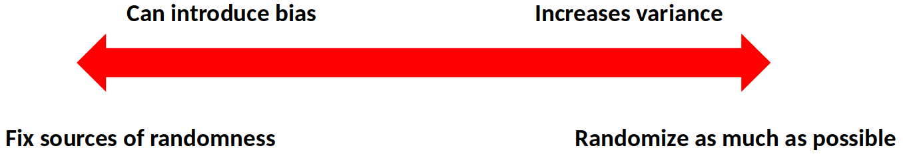

# Disclaimer

\input{../disclaimer.tex}

---

# Overview

- Evaluating interpretability in the interpretable ML community:
  - Interpretability depends on human experience of the model
  - Disagreement about the best way to measure it
- These papers:
  - Evaluating factors related to interpretability through user studies

\begin{center}
 \includegraphics[width=0.5\columnwidth]{imgs/overview.png} 
\end{center}

---

# Other Relevant Fields

- **Human-Computer Interaction (HCI):**
  - Theories for how people **interact with technology**
- **Psychology:**
  - Theories for how people **process information**
- Both have thought carefully about **experimental design**

\begin{center}
 \includegraphics[width=0.6\columnwidth]{imgs/relevant_fields.png} 
\end{center}

---

# Outline

- Research paper: **"Human Evaluation of Models Built for Interpretability"** by Lage et al.
- Research paper: **"Manipulating and Measuring Model Interpretability"** by Poursabzi-Sangdeh et al.
- Discussion

---

# Paper 1

\begin{center}
 \includegraphics[width=0.95\columnwidth]{imgs/paper1_title.png}
 \end{center} 

 [@lage2019human]

---

# Definitions

   - **Human-simulatability**: The ability of humans to mentally trace through a model's decision-making process and accurately predict its outputs for given inputs, essentially simulating how the model would behave.
   - **Decision set**: A logic-based machine learning model consisting of a collection of independent logical rules, where each rule maps a combination of input features to an output prediction.
   - **Decision set complexity**: A decision set is more complex when it has more rules, more conditions per rule, or conditions that are more cognitively difficult to evaluate.

---

# Contributions

## Research Questions:

- Which types of **decision set complexity** most affect human-simulatability?
- Is relationship between complexity and human-simulatability **context dependent**?

## Approach:

- Large scale, carefully controlled user studies

---

# Decision Sets

- **Logic-based models** are often considered interpretable
- Many approaches for **learning them from data** (Decision Trees)

\vspace{1cm}
\begin{center}
 \includegraphics[width=0.9\columnwidth]{imgs/decision_sets_example.png} 
\end{center}

---

# Regularizers

- **Regularizer (paper context)**: A technique that penalizes certain types of complexity during decision set training (such as number of rules, conditions per rule, or specific types of conditions) to make the models **less complex and more interpretable**.

- What kinds of complexity is it **most urgent to regularize** to learn interpretable models?

\vspace{.5cm}

\vspace{1cm}
\begin{center}
 \includegraphics[width=0.9\columnwidth]{imgs/regu.png} 
\end{center}

---

# Types of Complexity

- **Model size**: Number of rules/lines in the decision set
- **Variable repetitions**: Same variable appearing multiple times
- **Cognitive chunks**: Number of distinct logical conditions

\begin{center}
 \includegraphics[width=0.85\columnwidth]{imgs/complexity_types.png} \\
\vspace{0.5cm}
\large
\textbf{What if we optimized the models with data?}
\end{center}

---

# Context: Domains

\vspace{1em}
\begin{columns}
\begin{column}{0.48\textwidth}
 \includegraphics[width=\columnwidth]{imgs/alien_food.png}
 \begin{center}
 \textbf{Low Risk:} Alien meal recommendation
 \end{center}
\end{column}

\begin{column}{0.48\textwidth}
 \includegraphics[width=\columnwidth]{imgs/alien_medical.png} 
\begin{center}
\textbf{High Risk:} Alien medical prescription
\end{center}
\end{column}
\end{columns}

\vspace{1cm}

\begin{center}
\textbf{What if we used 2 different real domains?}
\end{center}

---

# Context: Tasks

\begin{columns}
\begin{column}{0.48\textwidth}
 \includegraphics[width=\columnwidth]{imgs/decision_set_tasks.png} 

\end{column}
\begin{column}{0.48\textwidth}
\begin{itemize}
    \item \textbf{Simulation:}
    \begin{itemize}
        \item What would the model recommend the alien?
    \end{itemize}
    \item \textbf{Verification:}
    \begin{itemize}
        \item Is \textit{milk and guava} a correct recommendation?
    \end{itemize}
    \item \textbf{Counterfactual:}
    \begin{itemize}
        \item If \textit{patient} were replaced with \textit{sleepy}, would the correctness of the \textit{milk and guava} recommendation change?
    \end{itemize}
\end{itemize}
\end{column}
\end{columns}

\vspace{0.5cm}

\begin{center}
\textbf{What if we used more realistic tasks?}
\end{center}

---

# Tradeoff Between Control and Generalizability

\begin{center}
\textit{Tradeoff} between the ability to \textit{tightly control} the experiment and \textit{running it under realistic conditions} (\textbf{generalizability})
\end{center}

\vspace{1cm}

\begin{center}
 \includegraphics[width=\columnwidth]{imgs/darrow.png} 
\end{center}

---

# Procedure

- Experiment posted on **Mturk**
- Takes around **20 minutes**
- Participants paid **3 USD**
- Excluded participants who could not complete practice questions
- Total: **50-70** participants **out of 150**

\vspace{1cm}

\begin{center}
\includegraphics[width=\columnwidth]{imgs/procedure.png}
\end{center}

---

# Statistical Analysis: Linear Model

We use a **linear model** for each metric in each experiment:

- Response time
- Accuracy
- Satisfaction

\vspace{1cm}

## Example – Model Size, Response Time:

- **Step 1:** Fit linear regression to predict response time from number of lines and number of output terms
- **Step 2:** Interpret coefficients as effects of number of lines and number of output terms on response time
  - The coefficient with the **largest magnitude** indicates which factor has the **strongest impact** on response time

---

# Statistical Analysis: Multiple Hypothesis Testing

\begin{center}
 \includegraphics[width=0.5\columnwidth]{imgs/xkcd_hypothesis.png} \\
 \tiny \url{https://xkcd.com/882/}
\end{center}

## We use a Bonferroni correction

- Instead of **p < 0.05**, use: **p < (0.05 / # comparisons)**

---

# Results: Complexity Increases Response Time

\begin{center}
\textbf{Recipe Domain} \\
 \includegraphics[width=0.6\columnwidth]{imgs/complexity_response_time.png} 
\end{center}

\begin{exampleblock}{Key Finding}
Greater complexity results in longer response time for all kinds of complexity
\end{exampleblock}

---

# Results: Type of Complexity Matters

\begin{center}
 \includegraphics[width=0.85\columnwidth]{imgs/complexity_comparison_table.png} 
\end{center}

\begin{exampleblock}{Key Finding}
\textbf{Response time for: cognitive chunks > model size > repeated terms}
\end{exampleblock}

---

# Results: Consistency - Domains, Tasks, Metrics

\begin{center}
 \includegraphics[width=0.7\columnwidth]{imgs/consistency_results.png}
\end{center}

\vspace{0.5cm}

\begin{exampleblock}{Key Findings}
Results consistent across domains, tasks and the response time and subjective difficulty metrics
\end{exampleblock}

---

# Results: Counterfactuals Are Hard

The counterfactual task is much more challenging than simulation!

\begin{center}
 \includegraphics[width=0.75\columnwidth]{imgs/counterfactual_difficulty.png} 
\end{center}
 

\vspace{0.5cm}

\begin{exampleblock}{Key Finding}
In all experiments, counterfactual tasks require longer response time than simulation tasks
\end{exampleblock}

---

# Discussion: Paper 1

- Consistent guidelines for interpretability
- Simplified tasks to measure interpretability
- Using Mturk workers as a proxy for domain experts

\vspace{1cm}

\begin{exampleblock}{Key Takeaway}
Different types of complexity affect \textit{human-simulatability} differently, with cognitive chunks having the strongest effect
\end{exampleblock}

---

# Paper 2

\begin{center}
 \includegraphics[width=0.98\columnwidth]{imgs/paper2_title.png} 
\end{center}

[@poursabzi2018manipulating]

---

# Motivation

- **Interpretability as a latent property** that can be manipulated or measured indirectly
- What are the factors through which it can be **manipulated effectively?**
- Bring **HCI methods** to interpretable ML since interpretability is defined by user experience

---

# Contributions

## Research Questions:

- How well can people estimate what a **model will predict**?
- How much do people **trust** a model's predictions?
- How well can people detect when a model has made a **sizable mistake**?

## Approach:

- Large-scale, pre-registered **user studies** to answer these questions in the context of **linear regression models**

---

# Comparison to Paper 1

- Studies **linear regression models** instead of decision sets
- Measures people's ability to make their **own predictions** in addition to forward simulation
- Uses **real-world housing dataset** and models optimized with data

---

# Ways to Manipulate Interpretability

\begin{center}
 \includegraphics[width=0.75\columnwidth]{imgs/ways_to_manipulate.png} 
\end{center}

---

# Procedure

- Participants shown:
  - **Training:** 10 apartments
  - **Testing:** 12 apartments (this is the data they use)
- Participants paid **2.5 USD**
- **750-1,250** participants per experiment

\vspace{1cm}

\begin{center}
\textbf{Each Trial:}\\
\vspace{.5cm}
 \includegraphics[width=0.60\columnwidth]{imgs/each_trial.png} 
\end{center}

---

# Statistical Analysis: Participant Specific Effects

- A **repeated measures** experimental design
   - Each participant makes many predictions
- Use a **mixed-effects model** to control for correlations between a participant's responses
   - Assumes a random, participant-specific effect

---

# Statistical Analysis: Multiple Hypothesis Testing

- **Pre-registering hypotheses** corresponds to deciding and publishing which analyses you will run **before collecting data**
- Reduces the probability that effects were discovered by chance

\vspace{1cm}

\begin{exampleblock}{Example}

\textbf{4) Specify exactly which analyses you will conduct to examine the main question/hypothesis."}\\
\vspace{.3cm}
We will use 2-by-2 ANOVA for statistical analysis of the effect of number of features and model clarity on final deviation from model's prediction and simulation error. \\
\vspace{.3cm}
\raggedleft \url{https://aspredicted.org/xy5s6.pdf}
\end{exampleblock}

---

# Design Choices

- **Randomized the order** of the first 10 (normal) apartments and **fixed the order** of the last 2 (unusual)
- All participants are shown an **identical set of apartments**
- Each participant completed **a single condition** (between subjects design)

\vspace{1cm}

---

# Results: Simulating Small, Transparent Models

\begin{center}
\textbf{Experiment 1: New York City prices}\\
\vspace{.25cm}
 \includegraphics[width=0.5\columnwidth]{imgs/simulation_error_nyc.png} 
\end{center}

\vspace{.5cm}

\begin{exampleblock}{Key Finding}
Best simulation accuracy with small, transparent models (CLEAR-2)
\end{exampleblock}

---

# Results: No Difference in Trust or Prediction

\begin{center}
\textbf{Experiment 1: New York City prices}\\
\vspace{.25cm}
\includegraphics[width=.95\columnwidth]{imgs/deviation_prediction_results.png} 
\end{center}

\vspace{.5cm}

\begin{exampleblock}{Key Finding}
None of the conditions are statistically different for trust or prediction error
\end{exampleblock}

---

# Results: Clear Models Make Mistakes Worse

\begin{center}
\textbf{Experiment 1: New York City prices}\\
\vspace{.25cm}
\includegraphics[width=0.7\columnwidth]{imgs/deviation_unusual.png} 
\end{center}

\vspace{0.25cm}

\begin{alertblock}{Surprising Finding}
Participants deviate \textit{less} from the bad prediction with clear models (CLEAR-2, CLEAR-8)
\end{alertblock}

---

# Additional Experiments

- Scaled down prices to better reflect national average
   - **Same results**
- Better trust metrics
   - **No significant difference in trust between models**
- Attention check for unusual features
   - **People catch more errors** when explicitly asked to look for unusual inputs

---

# Discussion: Paper 2

Key findings from the experiments:

- Highlighting weird inputs helps catch errors
- Having people predict before seeing the model helped catch errors
- **Transparency actually makes people worse at catching errors**

\vspace{1cm}

\begin{alertblock}{Counterintuitive Result}
More interpretable models (transparent, fewer features) led to worse error detection on unusual cases
\end{alertblock}

---

# General Discussion

## Comparing Both Papers:

- **Paper 1:** Decision sets, controlled synthetic domains, cognitive complexity matters
- **Paper 2:** Linear models, real-world data, transparency can backfire

\vspace{1cm}

## Key Lessons:

- Interpretability is multifaceted and context-dependent
- User studies are essential for evaluating interpretability
- Simplified models ≠ always better decision-making
- Different tasks require different evaluation metrics

---

\begin{center}
\Huge Thank You!
\end{center}

---

# References {.allowframebreaks}

\footnotesize
