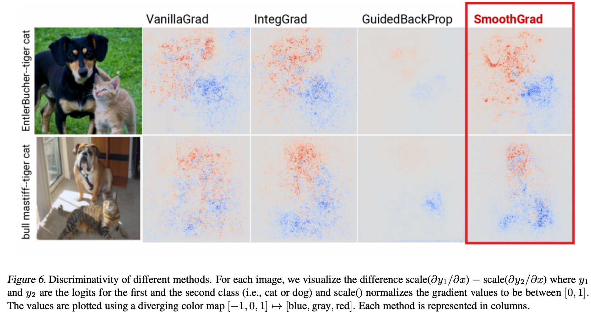

# Disclaimer

\input{../disclaimer.tex}

---

# Paper 1

\begin{center}
\includegraphics[width=0.9\columnwidth]{imgs/smoothgrad_paper.png}
\end{center}

[@smilkov2017smoothgrad]

---

# Motivation

:::: columns
::: {.column width="48%"}

We want **post-hoc explanations of image classifiers**

## *Solution*:

- **Sensitivity maps** (a.k.a. saliency maps, pixel attribution maps)
- Visual interpretation of gradient of class activation function w.r.t input image
  - Structured as grayscale image w/ dimension same as input image
  - Brightness of pixel $\propto$ importance to classification decision

:::
::: {.column width="50%"}

\begin{center}
\includegraphics[width=0.45\columnwidth]{imgs/motivation_gazelle.png}
\end{center}

:::
::::

---

# Background: Gradients as Sensitivity Maps

- $N$: network that classifies images into one class from set $C$
- Given input image $x$, $N$ typically computes class activation function $S_c$ for each $c \in C$
- Final classification $\text{class}(x) = \text{argmax}_{c \in C} \, S_c(x)$
- **Sensitivity map given by**

$$M_c(x) = \partial S_c(x)/\partial x$$

- ***Intuition***: $M_c$ represents \underline{how much difference} a \underline{tiny change} in each pixel of $x$ would make to the classification score for class $c$.
- In practice, this is done with **backpropagation** — same as during training, but instead of updating weights, we stop at the input pixels. The result is a gradient map with one value per pixel.

---

# Related Work: Perturbation Methods

- **Key idea:** generate a perturbed dataset to fit an explainable model
  - LIME
  - KernelSHAP

\begin{center}
\includegraphics[width=0.60\columnwidth]{imgs/lime_perturbation.png}
\end{center}

---

# Related Work: Backpropagation

Smothgrad lives in the family of backpropagation-based methods for explaining neural networks.

\small
All methods propagate a signal backwards from the output to the inputs to assign importance scores to pixels — just like training, but stopping at the input. They differ in **how** they modify that signal along the way:

:::: columns
::: {.column width="30%"}

\begin{center}
\includegraphics[width=0.60\columnwidth]{imgs/backprop_network.png}
\end{center}

:::
::: {.column width="70%"}
\small
- **Vanilla gradients** — raw gradient $\partial S_c / \partial x$, no modifications. Baseline for SmoothGrad.
- **Integrated Gradients** — averages gradients along a path from a reference image to $x$.
- **DeepLIFT** — propagates activation *differences* relative to a reference, instead of raw gradients.
- **LRP** — redistributes output relevance backwards layer by layer using conservation rules.
- **Guided Backprop / Deconvolution** — discards negative gradients through ReLUs to highlight only positive contributions.

:::
::::

\begin{center}
\textbf{SmoothGrad is complementary}, not a replacement — it can be applied on top of any of these to reduce visual noise.
\end{center}

---

# Limitations of Sensitivity Maps

\begin{center}
\large \textbf{Visually noisy}
\end{center}

- Often highlight pixels that–to a human eye–seem randomly selected
- *a priori*, we cannot know if this noise reflects an underlying truth about how networks perform classification, or is due to more superficial factors
- This is why saliency maps are typically visualized as a heatmap-like plot.

\begin{center}
\includegraphics[width=0.50\columnwidth]{imgs/motivation_gazelle2.png}
\end{center}

---

# Theory Behind SmoothGrad: Noisy Gradients

\begin{center}
\large \textbf{Key idea:} Noisy maps are due to noisy gradients
\end{center}

- The derivative of $S_c$ may fluctuate sharply at small scales — networks use **ReLUs, so $S_c$ is not even continuously differentiable**.
- *Two images that look identical to a human can have very different gradients — so the raw gradient at a single point is not a reliable importance signal.*
- The noise you see in the map is not necessarily telling you something meaningful
it may just be an accident of the mathematical landscape of $S_c$

\begin{center}
\includegraphics[width=0.62\columnwidth]{imgs/noisy_gradients_plot.png}
\end{center}

---

# SmoothGrad: Intuition

\begin{center}
\large \textbf{Simple solution}
\end{center}

- take an image of interest
- sample similar images by adding Gaussian noise to the image
- take the average of the resulting sensitivity maps for each sampled image
- This \underline{smoothes} the gradient

---

# SmoothGrad: Algorithm

1. Take random samples in a neighborhood of an input $x$ with added noise
2. Average the resulting sensitivity maps

\textbf{
$$\hat{M}_c(x) = \frac{1}{n} \sum_{1}^{n} M_c(x + \mathcal{N}(0, \sigma^2))$$
}

\vspace{1em}

- $n$ is the number of samples,
- $\mathcal{N}(0, \sigma^2)$ represents Gaussian noise with standard deviation $\sigma$.

---

# Experimental Setup

- Performed SmoothGrad on visualizations of two neural networks:
  - Inception v3 model by Google that was trained on the ILSVRC-2013 dataset
  - Convolutional MNIST model based on the TensorFlow tutorial

\begin{center}
\includegraphics[width=0.55\columnwidth]{imgs/bombardino.png}
\end{center}

---

# Choosing Hyperparameters (${\sigma}$: std. dev.)

\begin{center}
\includegraphics[width=.75\columnwidth]{imgs/hyperparams_sigma.png}
\end{center}

:::: columns
::: {.column width="50%"}
\textbf{$\quad \hat{M}_c(x) = \frac{1}{n} \sum_{1}^{n} M_c(x + \mathcal{N}(0, \sigma^2))$}
:::
::: {.column width="50%"}
\textbf{${\sigma}$}: the standard deviation of the Gaussian noise
:::
::::

---

# Choosing Hyperparameters ($n$: sample size)

\textbf{
$$\hat{M}_c(x) = \frac{1}{n} \sum_{1}^{n} M_c(x + \mathcal{N}(0, \sigma^2))$$
}

\begin{center}
\includegraphics[width=0.85\columnwidth]{imgs/hyperparams_n.png}
\end{center}

---

# Qualitative Results: Visualization Techniques

- **Absolute Value of Gradients**
  - depends on the characteristics of dataset

  \begin{center}
\includegraphics[width=0.85\columnwidth]{imgs/abs.png}
\end{center}

- **Capping outlying values**
  - presence of few pixels that have much higher gradients than the average
  - capping to 99 percentile
- **Multiplying maps with images**
  - produce simpler \& sharper images (Shrikumar et al., 2017; Sundararajan et al., 2017)
  - Downside: Pixels with values of 0 will never show up on the sensitivity map.
  - Upside: when viewing the importance of the feature as contribution to the image

---

# Qualitative Results: Visual Coherence 1/2

\begin{definition}{\textbf{Visual Coherence}}
Highlights are only on the object of interest, not the background
\end{definition}

Comparison with three gradient-based methods

- Vanilla gradient
- Integrated Gradients
- Guided BackProp

---

# Qualitative Results: Visual Coherence 2/2

\begin{center}
\includegraphics[width=.88\columnwidth]{imgs/visual_coherence_fig5.png}
\end{center}

---

# Qualitative Results: Discriminativity

:::: columns

::: {.column width="40%"}

\begin{definition}{\textbf{Discriminativity}}
the ability to explain / distinguish separate objects without confusion
\end{definition}

\vspace{0.5em}

**Open Problem**

Which properties affect the discriminativity of a given methods?

- Why did GBP show the worst performance?

:::

::: {.column width="58%"}

:::

::::

---

# Combining with Other Methods

\begin{columns}
\begin{column}{0.40\textwidth}

The same smoothing procedure can be used to augment any gradient-based method.

\end{column}
\begin{column}{0.58\textwidth}

\begin{center}
\includegraphics[width=\columnwidth]{imgs/combining_methods.png}
\end{center}

\end{column}
\end{columns}

---

# Limitations / Discussion

- Completely qualitative results, can we get **quantitative metrics**?
- Noisy sensitivity maps are **due to noisy gradients**
  - Is this true?
  - \underline{Future work}: look for further evidence and theoretical arguments
- Does SmoothGrad **generalize** to other networks \& tasks?
- How do we tradeoff between making picture pretty and being faithful to the model? Do you think SmoothGrad handled this tradeoff well?

---

# Paper 2

\begin{center}
\includegraphics[width=0.9\columnwidth]{imgs/ig_paper.png}
\end{center}

[@sundararajan2017axiomatic]

---

# Motivation and Problem Statement

\begin{columns}
\begin{column}{0.55\textwidth}

- Feature Attribution:

\begin{definition}{}
Formally, suppose we have a function $F : \mathbb{R}^n \to [0,1]$ that represents a deep network, and an input $x = (x_1, \ldots, x_n) \in \mathbb{R}^n$. An attribution of the prediction at input $x$ relative to a baseline input $x'$ is a vector $A_F(x, x') = (a_1, \ldots, a_n) \in \mathbb{R}^n$ where $a_i$ is the contribution of $x_i$ to the prediction $F(x)$.
\end{definition}

\end{column}
\begin{column}{0.43\textwidth}

\begin{center}
\includegraphics[width=\columnwidth]{imgs/ig_mnist_attribution.png}
\end{center}

\end{column}
\end{columns}

- Examples: in a CNN an attribution method could reveal which pixels were responsible for a certain label being picked (we saw this with LIME/SHAP)
- Problem: attribution technique are hard to evaluate empirically - hard to separate errors from model vs errors from attribution method
  - Ex. Gradients
  - Baseline: black image, empty text, etc.

---

# Summary of Contributions

- Present two axioms: **Sensitivity** and **Implementation Invariance**
  - **Sensitivity:** For every input and baseline that differ in one feature but have different predictions then the differing feature should be given a non-zero attribution.
  - **Implementation Invariance:** The attributions are always identical for two functionally equivalent networks.
- 2 axioms $\to$ **integrated gradients**
  - Overview: path integral of the gradients along the straight line path from an input x to a baseline input x'

---

# Two Axioms (Desiderata)

\begin{columns}
\begin{column}{0.48\textwidth}

\textbf{Sensitivity (a)}

**Definition:** When 2 inputs that differ in only one feature result in different predictions, the **differing feature** should be given a **non-zero attribution**.

\end{column}
\begin{column}{0.48\textwidth}

\textbf{Invariance}

**Definition:** The attributions are always identical for two functionally equivalent networks.

$$\frac{\partial f}{\partial g} = \frac{\partial f}{\partial h} \cdot \frac{\partial h}{\partial g}$$

\end{column}
\end{columns}

---

# Other Attribution Methods

\textbf{Gradients (of the output with respect to the input)}

- Breaks sensitivity - prediction function can flatten at the input, giving 0 gradient despite function value at the input being different from the baseline
- Example:
  - Single ReLU network: $f(x) = 1 - \text{ReLU}(1 - x)$
    - Baseline: $x = 0$, input: $x = 2$
    - $f(0) = 0$, $f(2) = 1$
    - Since $f$ is flat at $x = 1$, gradient gives attribution of 0 to $x$

---

# Other Attribution Methods: Methods that Break Sensitivity

\textbf{Methods that Break Sensitivity}

- DeConvNets, Guided back-propagation

\begin{center}
\includegraphics[width=0.78\columnwidth]{imgs/ig_break_sensitivity.png}
\end{center}

- Only back-prop through a ReLU if the ReLU is turned on at the input
  - Attribution is 0 for features with 0 gradients, despite non-zero gradient at the baseline

---

# Other Attribution Methods: Methods that Break Implementation Invariance

\textbf{Methods that Break Implementation Invariance}

- DeepLift and Layer-wise relevance propagation (LRP)

\begin{center}
\includegraphics[width=0.72\columnwidth]{imgs/ig_break_invariance.png}
\end{center}

- Replace gradients with discrete gradients, use a modified form of backpropagation
- Chain rule doesn't hold for discrete gradients (calculating gradients would be different) $\to$ breaks implementation invariance

---

\begin{center}
\vfill
\Large The Method
\vfill
\end{center}

---

# Integrated Gradients

\begin{columns}
\begin{column}{0.50\textwidth}

\textbf{Definition}

The **path integral** of the gradients along the **straight-line path** from the baseline $x'$ to the input $x$.

\small
$$\text{IntegratedGrads}_i(x) :=$$
$$(x_i - x'_i) \times \int_{\alpha=0}^{1} \frac{\partial F(x' + \alpha \times (x-x'))}{\partial x_i} \, d\alpha$$

\end{column}
\begin{column}{0.48\textwidth}

\textbf{New Axiom}

**Completeness:** The sum of the attributions is equal to the difference of the outputs.

\vspace{0.5em}

\small
*Proposition 1.* If $F : \mathbb{R}^n \to \mathbb{R}$ is differentiable almost everywhere$^1$ then

$$\sum_{i=1}^{n} \text{IntegratedGrads}_i(x) = F(x) - F(x')$$

\end{column}
\end{columns}

---

# Uniqueness of Integrated Gradients

\begin{columns}
\begin{column}{0.50\textwidth}

\textbf{Path Methods}

\begin{center}
\includegraphics[width=0.88\columnwidth]{imgs/ig_path_methods.png}
\end{center}

\small
$$\text{PathIntegratedGrads}_i^\gamma(x) :=$$
$$\int_{\alpha=0}^{1} \frac{\partial F(\gamma(\alpha))}{\partial \gamma_i(\alpha)} \frac{\partial \gamma_i(\alpha)}{\partial \alpha} \, d\alpha$$

\end{column}
\begin{column}{0.48\textwidth}

\textbf{Axioms}

\small
- **Sensitivity (b):** If the function does not depend (mathematically) on some input, then the attribution for that input is always zero.
- **Linearity:** Attributions preserve any linearity within the network.
$$a \times f_1 + b \times f_2$$
- **Symmetry-Preserving:** For symmetric variables, if they have identical values in the input and identical values in the baseline, they then receive identical attributions.
$$\text{Si} \ F(x, y) = F(y, x)$$

\end{column}
\end{columns}

---

# Using Integrated Gradients

\begin{columns}
\begin{column}{0.48\textwidth}

\textbf{Selecting a Baseline}

**Two Components:**

- Zero-Score: $F(x') \approx 0$
- Conveys Absence of Signal

**Examples:**

- Object Recognition: All-black image
- Text: All-zero input embedding vector

\end{column}
\begin{column}{0.50\textwidth}

\textbf{Computing IGs}

\small
$$\text{IntegratedGrads}_i^{\text{approx}}(x) :=$$

$$(x_i - x'_i) \times \sum_{k=1}^{m} \frac{\partial F\!\left(x' + \frac{k}{m} \times (x-x')\right)}{\partial x_i} \times \frac{1}{m}$$

\end{column}
\end{columns}

---

\begin{center}
\vfill
\Large Experimental Results
\vfill
\end{center}

---

# Object Recognition CNN

**Task:** Given image, predict the category of the object

\begin{center}
\includegraphics[width=0.88\columnwidth]{imgs/ig_object_recognition.png}
\end{center}

---

# Question Classification CNN

**Task:** Given question, predict what type of answer it is looking for.

\begin{center}
\includegraphics[width=0.85\columnwidth]{imgs/ig_question_classification.png}
\end{center}

---

# Machine Translation RNN

**Task:** Given English sentence, predict German translation

\begin{center}
\includegraphics[width=0.88\columnwidth]{imgs/ig_machine_translation.png}
\end{center}

---

# Ligand Screening Graph CNN

**Task:** Given molecular graph, predict whether it is active against an enzyme

\begin{center}
\includegraphics[width=0.85\columnwidth]{imgs/ig_ligand_screening.png}
\end{center}

**Take-aways:**

- More attribution to atom-pairs with bond (46%) compared to without bond (-3%)
- Attribution can help identify degenerate features (e.g. indicate that features are not fully convolved) (?)

---

# Conclusion and Discussion

\textbf{Summary}

- Formalizes two axioms for attribution: **sensitivity, implementation invariance**
- Propose **integrated gradients** and argue that it is theoretically superior to other gradient-based methods (e.g. DeepLift, LRP, guided backprop, etc.)
- Perform experiments across several domains to showcase method

\textbf{Discussion Questions}

- Are you convinced that these axioms are desirable?
- Do you see any strengths or weaknesses in the idea of producing explanations through an integrated path?
- Have the experiments convinced you of the superiority of their method?

---

\begin{center}
\Huge Thank You!
\end{center}

---

# References {.allowframebreaks}

\footnotesize
