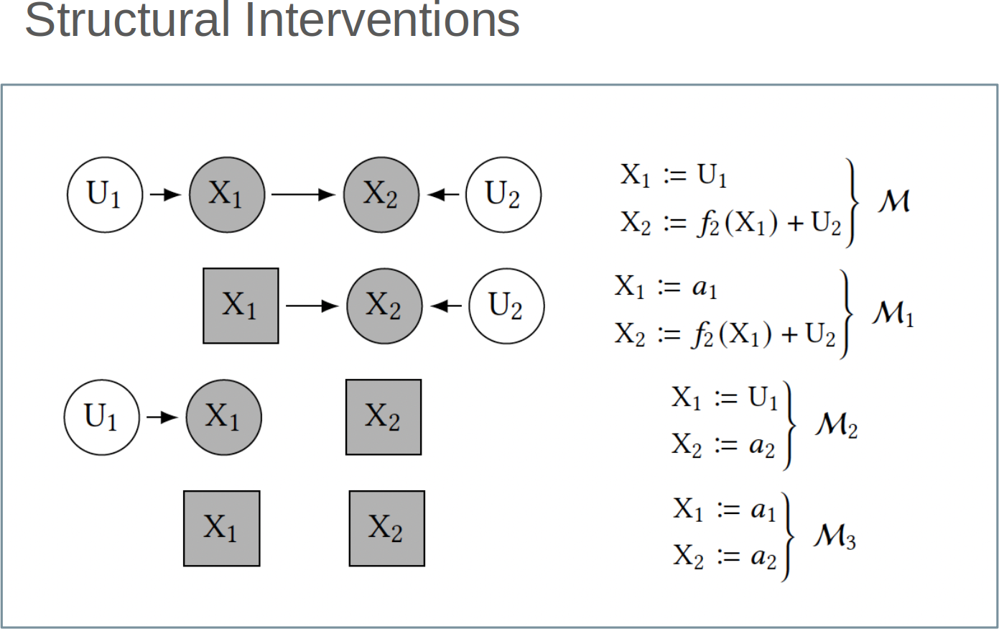
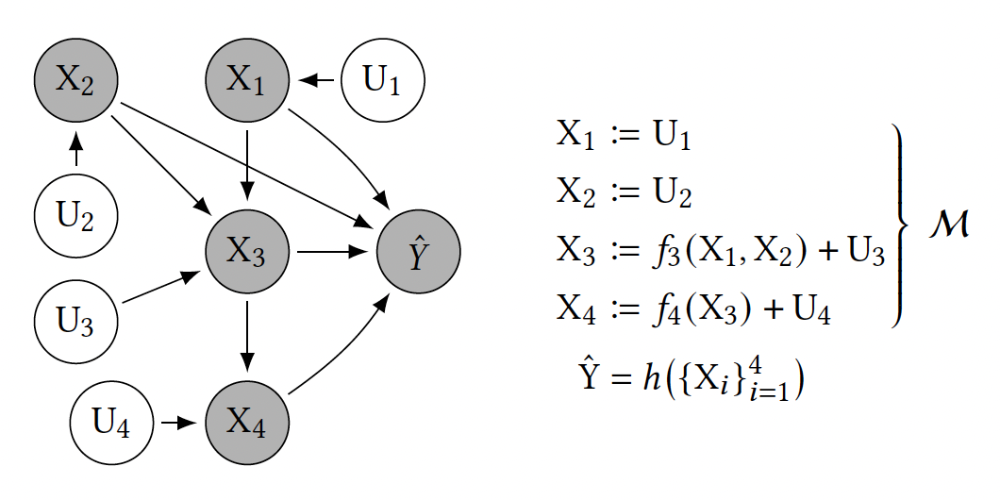
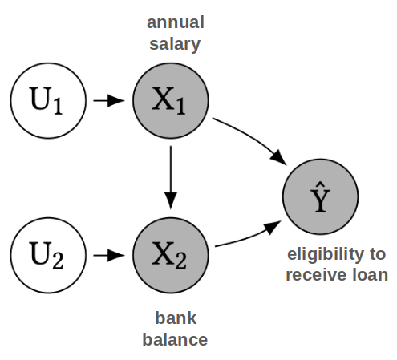
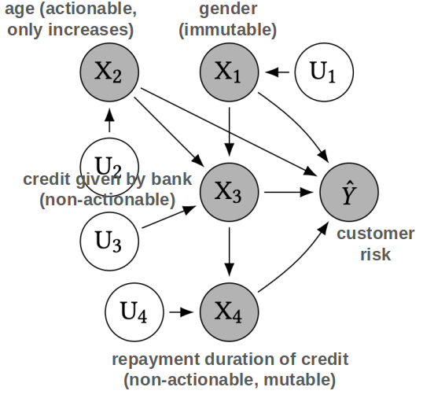

# Disclaimer

\input{../disclaimer.tex}

---

# Paper 1

\begin{center}
\includegraphics[width=0.9\columnwidth]{imgs/paper1_title.png}
\end{center}

[@wachter2017counterfactual]

---

# Introduction + Motivation

**EU General Data Protection Regulation (2018)**

:::: columns
::: {.column width="48%"}

- "the toughest privacy and security law in the world"
- Article 13-14, regarding automated decision-making: "meaningful information about the logic involved"
- Recital 71: "the right to obtain an explanation of the decision reached and to challenge the decision"

:::
::: {.column width="50%"}

\begin{alertblock}{4 Key Problems}
\begin{enumerate}
\item Not legally binding
\item Only applicable in limited cases
\item Explainability is technically very challenging
\item Competing interests of data controllers, subjects, etc.
\end{enumerate}
\end{alertblock}

:::
::::

---

# Unconditional Counterfactual Explanations

**Authors propose**

- **3 aims for explanations**
  - Inform and help the subject understand "why"
  - Provide grounds to contest decisions
  - Understand options for recourse
- **CFEs**
  - Fulfill the above goals
  - Overcome challenges w.r.t. current interpretability work
  - Can bridge the gap between interests of data subjects and data controllers

\vspace{1em}
\begin{center}
\huge
\textbf{Do you buy this?}
\end{center}

---

# Unconditional Counterfactual Explanations

- **Definition:**
  - A statement of how the world would have to be different for a desirable outcome to occur
  - **Because** of features $\{x_1, x_2\}$, $x$'s outcome was label $y_1$
  **If** $x = \{x_1 + \delta_1, x_2 + \delta_2\}$, **then** $y_2$.
- **Example:**
  - "You were denied a loan **because** your annual income was \$30000.
  **If** your income has been \$45000, **you would have been offered a loan**"

## Notes

- No one \textbf{unique} CF
- Need to consider \textbf{actionability} (mutability of variables)
- Providing \textbf{several diverse} CFEs may be more useful than simply the closest/shortest one

---

# Background + Related Work

- Historic context of knowledge
- Prior explainability work
- Adversarial examples/perturbations
- Causality/Fairness

---

# Background: Historic Context of Knowledge

- In order to know something, it is not enough to simply **believe** that it is true: rather, you must also have a good **reason** for believing it
- If $q$ were false, $S$ would not believe $p$

## Note

- This statement only describes $S$'s \textbf{beliefs}, which might not reflect reality
- This statement can be made without knowledge of the \textbf{causal relationship} between $p$ and $q$
- Q: who is $S$? The user? The model? Us?

---

# Background: Previous Explanations in AI/ML

- **Previously:** providing insight into the internal state of an algorithm, human-understandable approximations of the algorithm

- Three-way tradeoff between:
  1. quality of approximation
  2. ease of understanding the function
  3. size of the domain for which the approximation is valid

- **CFEs:**
  - Minimal amount of information
  - Require no understanding of internal logic of model
  - No approximation (although might not always be minimum length)
  - Con: May be overly restrictive

---

# Background: Adversarial Perturbations (not the same)

* **Shared Mechanism:** Both find the minimal change ($\delta$) to flip a prediction: $f(x + \delta) = y'$.
* **The Contrast:**
    * **Adversarial:** Invisible, targets pixels, intended to **deceive**.
    * **Counterfactual:** *Sparse*, targets features, intended to **inform**.
* **The "Manifold" Requirement:**
    * Mathematical changes must be **plausible** in the real world.
    * GDPR requires explanations to be "meaningful," not just possible.
* **Key Insight:** A CFE is an adversarial attack with a **human-centric purpose**.

---

# Background: Causality and Fairness

* **Bias Detection:** CFEs act as an audit tool; they reveal if a decision is based on protected attributes (e.g., race, gender, age).
* **Counterfactual Fairness:** If the "shortest path" to a loan approval requires changing your race or gender, the model is demonstrably discriminatory.
* **Evidence of Disparate Treatment:** CFEs provide a "smoking gun" for auditors without needing to inspect the model's internal weights.
* **The Converse Question:** If a model is biased, will the CFE *always* change a protected attribute?
    * *Warning:* Bias often hides in "proxies" (e.g., ZIP code as a proxy for race).

---

# Summary of Contributions

**Core argument:** explaining automated decisions does not require opening the black box.

| Contribution | Key point |
|---|---|
| Complexity of ML explanations | Internal logic is too complex to convey to lay users |
| Counterfactual approach | Rooted in adversarial ML; no model internals required |
| GDPR alignment | CFEs satisfy transparency goals better than local approximations |

> **Bottom line:** CFEs shift the focus from *how the model works*
> to *what would need to change* --- actionable, model-agnostic, and legally compatible.

---

# Approach: Counterfactual Optimization

\begin{center}
\large
\textbf{$$\arg\min_{x'} \max_{\lambda} \; \lambda(f_w(x') - y')^2 + d(x_i, x')$$}
\end{center}

> **In plain terms:** find the closest point to $x_i$ that flips the prediction to $y'$.

| Symbol | Meaning |
|--------|---------|
| $x'$ | Counterfactual point (what we optimize) |
| $\lambda$ | Weight balancing target vs. proximity |
| $\lambda(f_w(x') - y')^2$ | Penalizes missing the target label |
| $d(x_i, x')$ | Penalizes distance from factual point |
| $\max_\lambda$ | Forces label flip to dominate over proximity |

**Procedure:** alternate --- optimize $x'$, then increase $\lambda$ until constraint is satisfied.

---

# Approach: Distance Metrics

$$d(x, x') = \sum_{k \in F} \frac{\|x_{i,k} - x'_k\|_p}{N_k}$$

\begin{center}
\textbf{In plain terms:} sum of per-feature differences, normalized so all features are comparable.
\end{center}

| Term | Meaning |
|------|---------|
| $x_{i,k} - x'_k$ | Change in feature $k$ |
| $\|\cdot\|_p$ | $\ell_1$ (sparse changes) or $\ell_2$ (smooth changes) |
| $N_k$ | Normalizing factor --- makes features comparable |

**Two normalizing choices:**

1. $N_k = \text{MAD}_k = \text{median}_{j}\bigl(|X_{j,k} - \text{median}_l(X_{l,k})|\bigr)$
2. $\qquad N_k = \text{std}_{j}(x_{j,k})$

---

# Experimental Results: LSAT 1/3

**Setup:** predict law school admission score from $\{$GPA, LSAT, Race$\}$ using a black-box model.
\vfill

**Goal:**

- For each below-average student, find the *minimal change* that brings their score to $y' = 0$ (population mean).
- *population mean*The minimum score to be considered an average candidate.

\vfill

## Key question:
Does the choice of distance metric produce
fair, realistic, and actionable counterfactuals?

---

# Experimental Results: LSAT

:::: {.columns}
::: {.column width="55%"}

:::
::: {.column width="45%"}
- Without normalization, the optimizer freely modifies Race ($-1.0$, $0.9$), producing impossible counterfactuals.
- MAD normalization makes changing Race relatively costly, keeping it fixed across all CFEs.
- Distance metric choice is not a technical detail --- it directly determines fairness and plausibility of recommendations.
:::
::::

---

# Experimental Results: Discussion

1. **Two practical design decisions for realistic CFEs:**

| Technique | Purpose |
|-----------|---------|
| Clipping | Truncate CFE values to observed data range |
| Clamping | Force categorical variables to valid values |

2. **We need reasobales counterfactual targets:**

| Dataset | Target $y'$ | Interpretation |
|---------|-------------|----------------|
| LSAT | $0$ | Reach population average score |
| PIMA | $0.5$ | Cross from high to low diabetes risk |

> **Note:** the choice of $y'$ is not neutral --- it encodes
> a normative judgment about what counts as a "desirable" outcome.

---

# Explanations and The GDPR

**GDPR Recital 71** requires that automated decisions include:
the right to obtain an explanation and to challenge the decision.

| Requirement | CFE response |
|-------------|-------------|
| Intelligible explanation | Simple "if-then" statements |
| No black-box exposure | CFEs depend only on external facts, not model internals |
| No trade secret violation | No algorithm details disclosed |
| Individual-level insight | Tailored to each data subject's situation |

> **Bottom line:** CFEs do not require opening the black box ---
> they satisfy GDPR goals while protecting data controllers' interests.

---

# Advantages of Counterfactual Explanations

- Bypass explaining the *internal workings* of complex machine learning system
- Simple to compute and convey
- Provide information that is both easily digestible and practically useful
  - Understanding the reasons for a decision
  - Contesting decisions
  - Altering future behaviour to receive a preferred outcome

\begin{alertblock}{}
\centering Possible mechanism to meet the explicit requirements and background aims of the GDPR
\end{alertblock}

---

# Legal Information Gaps on Contesting Decisions

**The GDPR leaves critical gaps for individuals seeking to contest automated decisions:**

- **Art. 16**
  - Data subject has the right to correct inaccurate data used to make a decision, but does not need to be informed of which data the decision depended
- **Art. 22**
  - Data subjects do not need to be informed of their right *not* to be subject to an automated decision

## CFEs close these gaps:

By revealing which features were most influential,
they give individuals the information needed to meaningfully contest a decision.

---

# Explanations to Alter Future Decisions

**The third goal of explanations:** not just to understand or contest,
but to guide the individual toward a better outcome.

| Source | Position |
|--------|----------|
| GDPR | Silent --- does not explicitly require forward-looking explanations |
| Art. 29 Working Party | Recommends suggestions on how to improve outcomes |
| CFEs | Naturally satisfy this goal --- show *what to change* and *by how much* |

> **Key advantage:** CFEs can address the impact of changing
> multiple variables simultaneously, producing realistic and actionable recourse paths.

---

# Empirical Evidence: Yacoby et al. (2020)

\begin{center}
\includegraphics[width=0.6\columnwidth]{imgs/yacoby.png}
\end{center}

**Setup:** 8 U.S. state court judges evaluated criminal risk assessments
accompanied by CFEs.

**Example CFE shown to judges:** *"If this defendant had stable employment, the system would have classified them as low risk."*

**Finding:** CFEs did not change judicial decisions because:

1. Misinterpretation: Judges see it as a claim about the defendant, not the model.
2. Irrelevance: Once understood, judges find it irrelevant to the case.

**Implication:** CFEs can be legally compliant and mathematically correct
yet fail entirely in practice due to user misinterpretation.

---

# Discussion: Limitations of CFEs (Wachter et al.)

**Who do these explanations actually serve?**

- **Developers:** debugging and model improvement
- **Data subjects:** recourse and contestation
- **Lawmakers:** accountability and compliance

**Two sources of misinterpretation:**

- **Causality:** CFEs describe model behavior, not real-world causal effects
- **Sparsity bias:** mathematically minimal changes may be unrealistic or unachievable

> **Takeaway:** CFEs tell you *where to go*, not *how to get there* ---
> this gap motivates Karimi et al.'s causal recourse framework.

---

# Paper 2

\begin{center}
\includegraphics[width=0.95\columnwidth]{imgs/paper2_title.png}
\end{center}

[@karimi2021algorithmic]

---

# Algorithmic Recourse

:::: {.columns}
::: {.column width="52%"}

- Increasingly algorithms are used to make consequential decisions for individuals
- Recourse: "*Systematic process of reversing unfavorable decisions made by algorithms and bureaucracies*"
  - Promoting **agency** and **trust**

\vspace{1cm}
\begin{center}
\includegraphics[width=0.8\columnwidth]{imgs/compass.png}
\end{center}

:::
::: {.column width="48%"}

\begin{center}
\includegraphics[width=0.75\columnwidth]{imgs/loan_approval.png}
\end{center}

:::
::::

---

# Paper's Main Contributions

**Starting point:** CFEs tell you *where to go* but not *how to get there*.

- **Contribution 1 --- Critique:** formalize the insufficiencies of CFE-based recourse,
  showing it fails when features are causally dependent.

- **Contribution 2 --- Framework:** propose Recourse through Minimal Interventions (MINT),
  grounding recourse in Structural Causal Models (SCMs).

- **Contribution 3 --- Validation:** demonstrate MINT on synthetic and real-world settings,
  achieving up to 65% cost reduction over CFE-based approaches.

## Key shift:
From finding the nearest counterfactual *instance*
to finding the minimal cost *action set* that achieves recourse.

---

# Nearest Counterfactual Explanations

\begin{center}
\includegraphics[width=0.70\columnwidth]{imgs/nearest_cfe.png}
\end{center}

- For a person with features $\mathbf{x}^F$ who was denied a loan, find the "nearest neighbor" $\mathbf{x}$ who was granted a loan
- Difference between $\mathbf{x}^F$ and $\mathbf{x}$ is an "explanation" for the loan denial for $\mathbf{x}^F$

---

# Nearest Counterfactual Explanation (CFE)

$$\mathbf{x}^{*\text{CFE}} \in \underset{\mathbf{x}}{\arg\min} \; \text{dist}(\mathbf{x}, \mathbf{x}^F) \quad \text{s.t.} \quad h(\mathbf{x}) \neq h(\mathbf{x}^F),\; \mathbf{x} \in \mathcal{P}$$

- **Finding nearest counterfactual explanation as an optimization problem**
  - $\mathbf{x}^{*\text{CFE}}$ is the Counter Factual Explanation
  - Function $h$ is the classifier
- **Distance metrics**
  - Lp norm; L1 norm divided by median absolute deviation; etc.

---

# Why Are CFEs Not Ideal for Recourse?

\begin{center}
CFEs provide \textbf{understanding} but do not necessarily lead to optimal \textbf{action recommendations}.
\end{center}

\vfill

- **Problem 1 --- Cost of actions (Ustun et al. 2019):**
    - CFEs assume all feature changes have equal and constant cost.
    - Example: going from \$0 to \$100k salary costs the same as \$800k to \$900k.
- **Problem 2 --- Causal blindness (Karimi et al. 2021):**
    - CFEs ignore downstream effects of actions on causally dependent features.
    - Example: increasing salary by 14% automatically raises bank balance by 30% of that amount ---
    CFEs miss this and recommend a costlier intervention.

\vfill

## Bottom line:
Acting on a CFE in the real world may be
suboptimal, infeasible, or simply wrong.

---

# Accounting for the "Cost" of Actions (Ustun et al. 2019)

**Key insight:** not all feature changes are equally easy --- recourse should minimize
*effort*, not just *distance*.

$$\begin{aligned}
\delta^* \in \underset{\delta}{\arg\min} \; &\text{cost}(\delta; \mathbf{x}^F) \\
\text{s.t.} \quad &h(\mathbf{x}^{\text{CFE}}) \neq h(\mathbf{x}^F) \\
&\mathbf{x}^{\text{CFE}} = \mathbf{x}^F + \delta \\
&\mathbf{x}^{\text{CFE}} \in \mathcal{P}, \quad \delta \in \mathcal{F}
\end{aligned}$$

## In plain English:

Find the cheapest set of changes $\delta$ to apply to $\mathbf{x}^F$
such that the prediction flips, the result is plausible $(\mathcal{P})$,
and the actions are feasible $(\mathcal{F})$ --- e.g., cannot reduce age or change race.

[@ustun2019actionable]

---

# Insufficiencies of Ustun et al. Formulation

$$\begin{aligned}
\delta^* \in \underset{\delta}{\arg\min} \; &\text{cost}(\delta; \mathbf{x}^F) \\
\text{s.t.} \quad &h(\mathbf{x}^{\text{CFE}}) \neq h(\mathbf{x}^F) \\
&\mathbf{x}^{\text{CFE}} = \mathbf{x}^F + \delta \\
&\mathbf{x}^{\text{CFE}} \in \mathcal{P}, \quad \delta \in \mathcal{F}
\end{aligned}$$

1. **Marginal cost of changing a feature is constant**
   - **Example:** Cost of going from salary \$0 to \$100k equals cost to go from salary \$800k to \$900k

2. **Doesn't consider downstream "causal" impact of actions**
   - **Example:** Loan decision for individual changed if "salary" reaches 100k (+33\%) or "bank balance" reaches 30k (+20\%). 20\% change seems easier.
   - However, best **action recommendation** is to increase salary by 14\% when 30\% of salary automatically saved to bank.

---

# Actions as Interventions: Structural Causal Model (SCM) 1/2

:::: columns
::: {.column width="48%"}

**Setup**

- $M$ ($M \in \Pi$) = $\langle F, X, U \rangle$: SCM
- $X$: endogenous (observed) variables
- $U$: exogenous (unobserved) variables
- $F$: $U \rightarrow X$, structural equations
- $A$ ($\Pi \rightarrow \Pi$): structural interventions, i.e. transformations between SCMs
  - of the form $A := \text{do}(\{X_i := a_i\}_{i \in I})$

:::
::: {.column width="48%"}

:::
::::

---

# Actions as Interventions: Structural Causal Model (SCM) 2/2

:::: columns
::: {.column width="48%"}

- **$\mathcal{M}$ (real world):** $X_2$ depends on $X_1$ --- causal edge exists.
- **$\mathcal{M}_1$ (intervene on $X_1$):** set $X_1 = a_1$, edge remains --- changing salary drags bank balance along.
- **$\mathcal{M}_2$ (intervene on $X_2$):** set $X_2 = a_2$, edge is severed --- bank balance forced independently of salary.
- **$\mathcal{M}_3$ (intervene on both):** set $X_1 = a_1$, $X_2 = a_2$ --- fully independent world. This is what CFEs assume, hence suboptimal.

:::
::: {.column width="48%"}

:::
::::

## The key observation
$\mathcal{M}_1 \neq \mathcal{M}_2 \neq \mathcal{M}_3$ --- each intervention produces a different post-intervention world with different consequences.

---

# Actions as Interventions: Structural Counterfactuals

\begin{center}
\textbf{If individual $x^F$ performs action set $A$ in world $\mathcal{M}$,
what will their new feature vector be?}
\end{center}

**Assumptions:**
- No hidden confounders (true SCM known)
- $F$ is invertible

**Two-step procedure:**

1. **Abduction** --- $F^{-1}(x^F)$: Infer exogenous variables $U$ from observed features
2. **Prediction** --- $F_A(U)$: Propagate action $A$ through the causal graph

$$x^{\text{SCF}} = F_A(F^{-1}(x^F))$$

## In plain English
First figure out *who this person is* (their latent $U$),
then compute *what happens to them* after the action, respecting all causal dependencies.

---

# Limitations of CFE-Based Recourse: Formalism

**Setup:**

- $x^F$: factual individual (current features)
- $\delta^*$: action recommendation from Ustun et al.
- $I = \{i \mid \delta^*_i \neq 0\}$: set of features to be changed

**Definition (CFE-based actions):**
$A^{\text{CFE}} := \text{do}(\{X_i := x^F_i + \delta^*_i\}_{i \in I})$

**Proposition:** $A^{\text{CFE}}$ guarantees recourse **if and only if** the descendants of $I$ in $G$ are empty.

**Corollary:** if all features are root-nodes of $G$ (independent world), CFE-based actions always guarantee recourse.

---

# Limitations of CFE-Based Recourse: Formalism In plain English

- **Definition:** force each feature in $I$ to its counterfactual value.
- **Proposition:** CFEs only guarantee recourse if changing $X_i$ does not drag any other variable along.
- **Corollary:** CFEs always work in a fully independent world --- exactly the world they implicitly assume, and one that rarely exists in practice

---

# Algorithmic Recourse via Minimal Interventions: Setup

:::: columns
::: {.column width="40%"}

$$\begin{aligned}
A^* \in \underset{A}{\arg\min} \; &\text{cost}(A; \mathbf{x}^F) \\
\text{s.t.} \quad &h(\mathbf{x}^{\text{SCF}}) \neq h(\mathbf{x}^F) \\
&\mathbf{x}^{\text{SCF}} = \mathbb{F}_A(\mathbb{F}^{-1}(\mathbf{x}^F)) \\
&\mathbf{x}^{\text{SCF}} \in \mathcal{P}, \quad A \in \mathcal{F}
\end{aligned}$$

:::
::: {.column width="60%"}

**Remarks:**

- $A^* \in \mathcal{F}$: optimal action set within feasible interventions
- $\text{cost}(\cdot\,; \mathbf{x}^F): \mathcal{F} \times X \rightarrow \mathbb{R}_+$: user-specified action cost
- $\mathbf{x}^{\text{SCF}} = \mathbb{F}_A(\mathbb{F}^{-1}(\mathbf{x}^F))$: structural counterfactual respecting causal dependencies
- $\mathbf{x}^{\text{SCF}} \neq \mathbf{x}^{\text{CFE}}$: the resulting instance differs from Ustun et al.'s solution

:::
::::

## In plain English
No longer ask *"what point should I reach?"* but *"what actions should I take?"* ---
accounting for the fact that actions propagate through the causal structure of the world.

---

# Algorithmic Recourse via Minimal Interventions: Formalism

:::: columns
::: {.column width="40%"}

$$\begin{aligned}
A^* \in \underset{A}{\arg\min} \; &\text{cost}(A; \mathbf{x}^F) \\
\text{s.t.} \quad &h(\mathbf{x}^{\text{SCF}}) \neq h(\mathbf{x}^F) \\
&\mathbf{x}^{\text{SCF}} = F_A(F^{-1}(\mathbf{x}^F)) \\
&\mathbf{x}^{\text{SCF}} \in \mathcal{P}, \quad A \in \mathcal{F}
\end{aligned}$$

:::
::: {.column width="60%"}

**Proposition:**

- $A^{\text{CFE}}$: recourse action derived from nearest counterfactual explanation
- $A^*$: recourse action from MINT

$$\text{cost}(A^*; \mathbf{x}^F) \leq \text{cost}(A^{\text{CFE}}; \mathbf{x}^F)$$
:::
::::

## In plain English
MINT always finds a recourse action that is at least as cheap as the CFE-based recommendation ---
and strictly cheaper whenever features are causally dependent.

---

# Algorithmic Recourse via Minimal Interventions: MINT

**Core requirement:** ability to compute $x^{\text{SCF}} = F_A(F^{-1}(x^F))$
for *any* feasible action $A \in \mathcal{F}$.

**Tractability assumption:** SCM is an additive noise model (ANM):
$$X_i := f_i(\text{pa}_i) + U_i$$

**Solution:** Abduction-Action-Prediction (Pearl et al.):

- **Abduction:** infer $U$ from observed $x^F$ via $F^{-1}(x^F)$
- **Action:** modify SCM according to $\text{do}(\{X_i := a_i\}_{i \in I})$
- **Prediction:** propagate through modified SCM to obtain $x^{\text{SCF}}$

## In plain English
ANMs make $F$ invertible, enabling exact computation of the
structural counterfactual for any action --- which is what MINT needs to solve the optimization.

---

# Abduction-Action-Prediction to Obtain $x^\text{SCF}$

:::: columns
::: {.column width="45%"}

$\{U_i\}^4_{i=1}$: mutually independent, exogenous

$\{f_i\}^4_{i=1}$: structural equations

$x = [x_1^F, x_2^F, x_3^F, x_4^F]^T$: observed factual features

:::
::: {.column width="52%"}

1. **Abduction:** compute exogenous variables
   - $u_1 = x_1^F$, $u_2 = x_2^F$, $u_3 = x_3^F - f_3(x_1^F, x_2^F)$, $u_4 = x_4^F - f_4(x_3^F)$

2. **Action:** modify SCM with interventions
   - $X_1 := [1 \in I] \cdot a_1 + [1 \notin I] \cdot U_1$
   - $X_2 := [2 \in I] \cdot a_2 + [2 \notin I] \cdot U_2$

3. **Prediction:** recursively compute endogenous variables
   - $x_1^{\text{SCF}} := [1 \in I] \cdot a_1 + [1 \notin I] \cdot u_1$
   - $x_3^{\text{SCF}} := [3 \in I] \cdot a_3 + [3 \notin I] \cdot (f_3(x_1^{\text{SCF}}, x_2^{\text{SCF}}) + u_3)$

:::
::::

---

# General Formulation and Solving the Optimization Problem

:::: columns
::: {.column width="50%"}

**General Formulation**

$$A^* \in \underset{A}{\arg\min} \; \text{cost}(A; \mathbf{x}^F)$$
$$\text{s.t.} \quad h(\mathbf{x}^{\text{SCF}}) \neq h(\mathbf{x}^F)$$
$$x_i^{\text{SCF}} = [i \in I] \cdot (x_i^F + \delta_i)$$
$$+ [i \notin I] \cdot (x_i^F + f_i(\mathbf{pa}_i^{\text{SCF}}) - f_i(\mathbf{pa}_i^F))$$
$$\mathbf{x}^{\text{SCF}} \in \mathcal{P}, \quad A \in \mathcal{F}$$

:::
::: {.column width="47%"}

**Remarks**

- $x_i^F + \delta_i$: intervention
- $f_i(\mathbf{pa}_i^F)$: factual values of $x_i$'s parents
- $f_i(\mathbf{pa}_i^{\text{SCF}})$: counterfactual values of $x_i$'s parents
- new closed-form expression for $F_{A^*}(F^{-1}(x^F))$ $\rightarrow$ use optimization methods

:::
::::

---

# Experimental Setup

:::: columns
::: {.column width="48%"}

**Synthetic setting:**

Generate data following causal generative process

:::
::: {.column width="48%"}

**Real-world setting:**

Use existing German credit dataset to learn structural causal model equations, by fitting a linear regression

:::
::::

\vspace{0.5cm}
\begin{center}
Cost for both is $\ell_1$ norm over normalized feature change
\end{center}

---

# Experimental Setup: Synthetic Setting

:::: columns
::: {.column width="45%"}

**Causal Generative Process**

:::
::: {.column width="52%"}

$U_1 \sim \$10000 \cdot \text{Poisson}(10)$, $U_2 \sim \$2500 \cdot N(0,1)$

$$X_1 := U_1$$
$$X_2 := f_2(X_1) + U_2, \quad X_2 := \frac{3}{10} \cdot X_1 + U_2$$
$$\hat{Y} = h(X_1, X_2), \quad h = \text{sgn}(X_1 + 5 \cdot X_2 - \$225000)$$

:::
::::

---

# Experimental Results: Synthetic Setting

\begin{center}
\small [annual salary, bank balance]
\end{center}

\begin{center}
\includegraphics[width=0.85\columnwidth]{imgs/synthetic_results1.png}
\end{center}

---

# Experimental Results: Synthetic Setting (cont.)

\begin{center}
\includegraphics[width=0.55\columnwidth]{imgs/synthetic_results2.png}
\end{center}

:::: columns
::: {.column width="48%"}
$\mathbf{x}^{*\text{SCF}}$ further dist from $\mathbf{x}^F$ than $\mathbf{x}^{*\text{CFE}}$
:::
::: {.column width="48%"}
**BUT**

$\text{cost}(\delta^*; x^F) \approx 2\, \text{cost}(A^*; x^F)$
:::
::::

---

# Experimental Setup: Real-World Setting

:::: columns
::: {.column width="45%"}

**Structural Causal Model**

:::
::: {.column width="52%"}

$$X_1 := U_1, \quad X_2 := U_2$$
$$X_3 := f_3(X_1, X_2) + U_3$$
$$X_4 := f_4(X_3) + U_4$$
$$\hat{Y} = h(\{X_i\}^4_{i=1})$$

$h$ can be logistic regression or decision tree

:::
::::

---

# Experimental Results: Real-World Setting

\begin{center}
\small [gender, age, credit given, credit repayment duration]
\end{center}

\begin{center}
\includegraphics[width=0.75\columnwidth]{imgs/realworld_results1.png}
\end{center}

---

# Experimental Results: Real-World Setting (cont.)

\begin{center}
\includegraphics[width=0.55\columnwidth]{imgs/realworld_results2.png}
\end{center}

\begin{center}
\textbf{42\% decrease in cost} using Karimi et al.'s formulation

Averaged over 50 test individuals, $39 \pm 24\%$ and $65 \pm 8\%$ decrease in cost, for $h$ as logistic regression and decision tree, respectively
\end{center}

---

# Future Work: Extended Kinds of Interventions

:::: columns
::: {.column width="45%"}

**Forms**

- **Structural/hard** (actions in Karimi et al.): unconditionally sever all edges incident on intervened node
- **Additive/soft:** do not sever incident edges

$$x_i^{\text{SCF}} = [i \in I] \cdot \delta_i + (x_i^F + f_i(\mathbf{pa}_i^{\text{SCF}}) - f_i(\mathbf{pa}_i^F))$$

**Scopes**

- Karimi et al. assumes action = intervention on endogenous variable
- **Fat-hand/non-atomic:** confounded/correlated interventions

:::
::: {.column width="52%"}

**Feasibility**

Can encode as constraints to amend to $A \in \mathcal{F}$

- **Immutable:** closed under ancestral relationships
- **Mutable but non-actionable:** $[i \notin I] = 1$ is sufficient
- **Actionable and mutable:** contingent on (a) pre-intervention value of variable (b) pre-intervention value of other variables (c) post-intervention value of variable (d) post-intervention value of other variables

:::
::::

---

# Future Work: Current Limitations

\begin{center}
\includegraphics[width=0.7\columnwidth]{imgs/limitations.png}
\end{center}

- **Reliance on true causal model of the world**
  - True for any approach suggesting actions to be performed in the real world
  - Study potential inefficiencies from partial/imperfect causal model

---

# Concluding Thoughts

- Overall an interesting work bridging counterfactual explanations (previous papers) and algorithmic recourse (next papers), clarifying their differences
- Tradeoff between generalizability of setting and hardness of optimization problem
  - Ustun et al. pursue algorithmic recourse in a specific linear setting
  - Karimi et al. pursue algorithmic recourse in general settings, require true causal model of world
  - Open question: where do we stand on this tradeoff? Consider the origins of counterfactual explanations in Wachter et al.

---

\begin{center}
\Huge Thank You!
\end{center}

---

# References {.allowframebreaks}

\footnotesize
