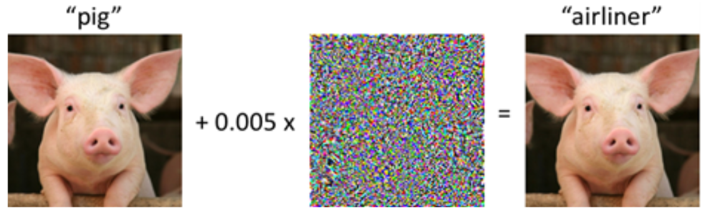
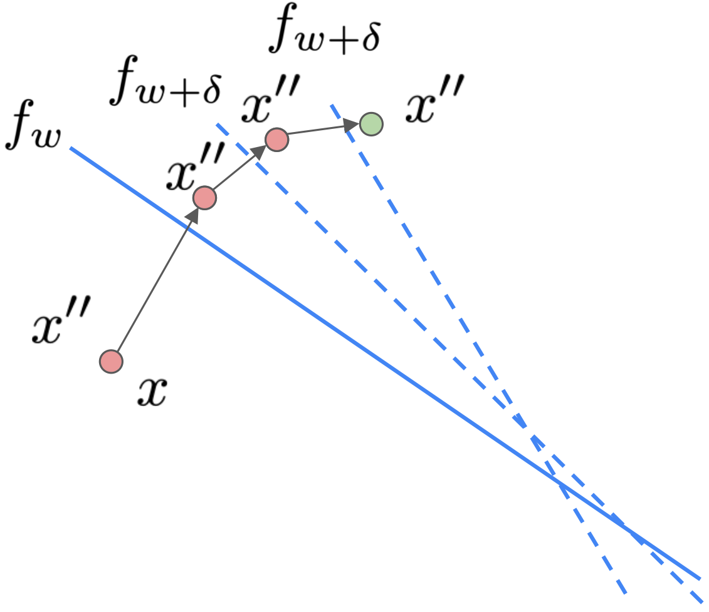
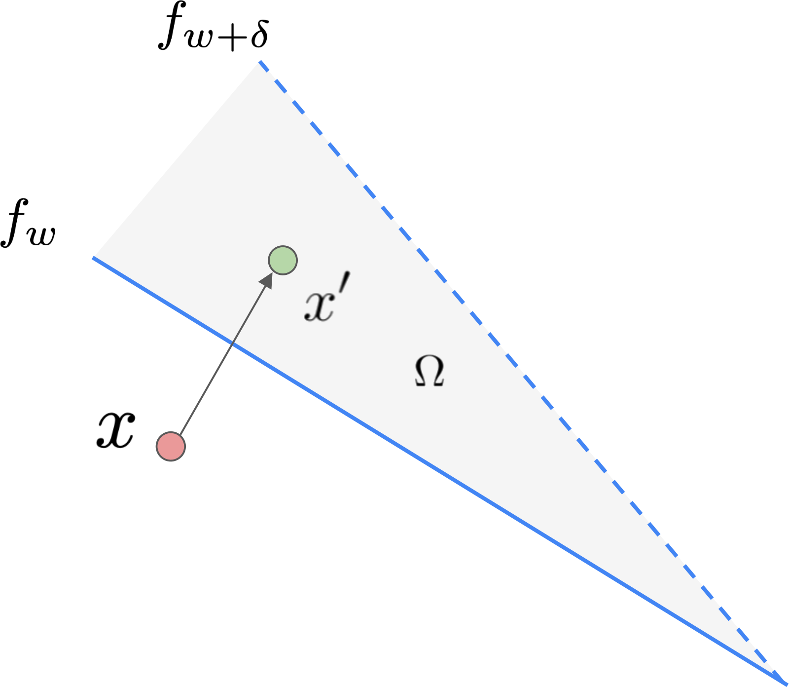
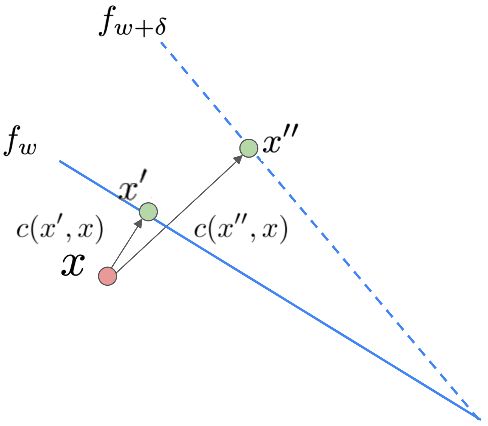

# Disclaimer

\input{../disclaimer.tex}

---

# Paper 1

\begin{center}
\includegraphics[width=0.85\columnwidth]{imgs/paper1_title.png}
\end{center}

[@upadhyay2021robust]

---

# Motivation

:::: columns
::: {.column width="48%"}

**Algorithmic Recourse**

- ML models are deployed in high stakes scenarios
- If you receive an unfavorable outcome as a result of a prediction, how can you reverse it?
- Ex: A bank might tell you to increase your salary by \$10,000

:::
::: {.column width="48%"}

**Model Updates**

- In practice, data collectors are (hopefully) frequently updating their datasets
- Models are updated to reflect dataset changes
- Current algorithms to generate counterfactuals **assume models are static**

:::
::::

---

# Motivation: An Example

:::: columns
::: {.column width="48%"}

\begin{center}
\includegraphics[width=\columnwidth]{imgs/motivation_example.png}
\end{center}

:::
::: {.column width="48%"}

\begin{alertblock}{}
Original suggested recourse for the datapoint no longer crosses the decision boundary when the model is updated/retrained
\end{alertblock}

:::
:::

---

# Summary of Contributions

- **Outline model + data shifts** that people should consider
  - Temporal shift
  - Geospatial shift
  - Data correction shift
- **Propose ROAR** — RObust Algorithmic Recourse
  - Introduces a novel minimax objective that can be used to construct robust actionable recourses while minimizing the recourse costs
- **Theoretical analysis**
  - How bad are regular counterfactuals under model shifts?
  - How much does the proposed method increase the cost of recourses when compared to normal CFs?
- **Experimental analysis**

---

# Related Work

\vspace{.5em}

:::: columns
::: {.column width="48%"}

**Algorithmic recourse**

**Can i still trust you?: Understanding the impact of distribution shifts on algorithmic recourses**: recourses generated by state-of-the-art algorithms are readily invalidated due to model shifts resulting from different kinds of dataset shifts

\vspace{1em}

:::
::: {.column width="48%"}

**Adversarial Training**

- Optimizes a **minimax objective** that captures the worst-case loss over a given set of perturbations to the input data
- At each gradient step, **computes the gradient at worst-case perturbation**
- Recent work explores robust feature attribution and rule-based explanations robust to *dataset* shifts

:::
::::

## In plain English
\small
Small, carefully chosen perturbations can break a system — be it a classifier or a recourse recommendation.

---

# Background: Recourse/Counterfactuals

:::: columns
::: {.column width="48%"}

**Optimal CF:**

$$x' = \underset{x' \in \mathcal{A}}{\arg\min}\; c(x, x') \quad \text{s.t.} \quad \mathcal{M}(x') = 1$$

**Unconstrained and differentiable relaxation:**

$$x' = \underset{x' \in \mathcal{A}}{\arg\min}\; \ell(\mathcal{M}(x'), 1) + \lambda\, c(x, x')$$

:::
::: {.column width="48%"}

**Notation Notes**

- $x$: specific data point
- $x'$: counterfactual
- $\mathcal{M}$: model (or linear approximation of model around point $x$)
- $C$: cost function (how hard is it to achieve the counterfactual)
- $\mathcal{A}$: actionable/possible counterfactuals

:::
::::

## In plain english

Find the cheapest change to your profile that flips the model's decision. The second formulation makes this optimizable.

---

# A Primer: Comparing Models Under Shifts

:::: columns
::: {.column width="52%"}

\begin{center}
\includegraphics[width=\columnwidth]{imgs/primer_models.png}
\end{center}

:::
::: {.column width="48%"}

A mean shift occurs when the average feature values of one or more classes move, causing the decision boundary to rotate and previously valid recourses to fail.

\vspace{2em}

## Key idea
**How to compare these models?** (especially if they are nonlinear and high-dimensional)

:::
:::

---

# Approach (Intuition)

## Adversarial Training

Perturb inputs slightly (maximize training loss) $\rightarrow$ gradient descent step on perturbed inputs (minimize training loss)

## ROAR

Perturb model slightly (maximize recourse loss) $\rightarrow$ gradient descent step on perturbed model (minimize recourse loss)

---

# Approach (Intuition): Diagram

:::: columns
::: {.column width="58%"}

\begin{center}
\includegraphics[width=0.7\columnwidth]{imgs/approach_diagram.png}
\end{center}

:::
::: {.column width="38%"}

## The Goal
Find $x''$ that remains valid under all model perturbations $\delta \in \Delta$

:::
:::

---

# Approach (Details)

$$x'' = \underset{x'' \in \mathcal{A}}{\arg\min} \; \underset{\delta \in \Delta}{\max} \; \ell(f_{w+\delta}(x''), 1) + \lambda\, c(x, x'')$$

\vspace{1em}

:::: columns
::: {.column width="62%"}

**Algorithm 1: Optimization Procedure**

**Input:** $x$ s.t. $f_w(x) = 0$, $f_w$, $\lambda > 0$, $\Delta$, learning rate $\alpha > 0$.

**Initialize** $x'' = x$, $g = 0$

**repeat**

- $\hat{\delta} = \arg\max_{\delta \in \Delta} \ell(f_{w+\delta}(x''), 1)$
- $g = \nabla[\ell(f_{w+\hat{\delta}}(x''), 1) + \lambda c(x'', x)]$
- $x'' -= \alpha g$

**until** convergence; **Return** $x''$

:::
::: {.column width="38%"}

:::
::::

---

# Approach (Details): Algorithm Walkthrough

The algorithm starts from $x'' = x$ (your current profile) and repeats two steps until convergence:

:::: columns
::: {.column width="62%"}

- **Step 1 — Attack:** fix $x''$ and find the $\hat{\delta}$ that damages it most —
  the shift most likely to push it back to the negative side of the boundary.
- **Step 2 — Defend:** fix $\hat{\delta}$ and move $x''$ via gradient descent to
  survive that worst case, without straying too far from $x$ (the term $\lambda c
  (x'', x)$ controls the cost).

\vspace{0.5em}

The diagram shows exactly this: $x''$ starts at $x$, crosses $f_w$ in the first step, then keeps moving until it lands in the green zone — valid under all possible $f_{w+\delta}$.

:::
::: {.column width="38%"}

:::
::::

## In plain English
Alternate between "find the worst model shift" and "move the recourse to survive it."

---

# Proofs: Theorem 1

:::: columns
::: {.column width="40%"}

:::
::: {.column width="58%"}

$\Omega = \{x' : w^T x' > 0 \cap (w+\delta)^T x' \leq 0\}$

... integrating over $\Omega$

$$P(x' \text{ is invalidated}) \geq$$
$$\frac{1}{2}\sqrt{\frac{2e}{\pi}} \frac{\sqrt{\beta-1}}{\beta} \exp\left(-\beta \frac{(w^T\mu)^2}{2\|\sqrt{D}Uw\|^2}\right)$$

**Assumptions:**
$x \sim \mathcal{N}(\mu, \Sigma)$, $x' \sim \mathcal{N}(\mu, \Sigma)$, $\Sigma = UDU^T$, $\beta \geq 1$

The theorem answers: how likely is a standard (non-robust) recourse to fail under a model shift? ($\Omega$ is the "danger zone")

:::
::::

## In plain English
If you use a standard recourse, there's a provably non-negligible chance it gets invalidated when the model updates — and this theorem quantifies that floor.

---

# Proofs: Theorem 2

:::: columns
::: {.column width="35%"}

:::
::: {.column width="63%"}

w.h.p. $(1 - \eta')$:

$$c(x'', x) \leq c(x', x) +$$
$$\frac{1}{\lambda\|w+\delta\|}\alpha(w+\delta)^T\mu + \sqrt{\frac{D^2}{2}\log\frac{1}{\eta'}}$$

**Assumptions:**

- Log-loss + simple model
- Optimal solution for $x''$
- $D$ is a bound for the "diameter" of dataset (l2)

The theorem answers: **how much more expensive is the robust recourse compared to the standard one?**

:::
::::

## In plain English
Robust recourse costs more than standard recourse, but the extra cost is bounded — and the bound grows with how much you allow the model to shift.

---

# Experimental Results

:::: columns
::: {.column width="48%"}

**Real World Datasets**

- German Credit → Data Correction Shift
- Small Business Administration → Temporal Shifts
- Portuguese Student Performance → Geospatial Shift

**Synthetic Datasets**

- 2 Gaussians: Mean Shift, Variance Shift, Mean & Variance Shift

:::
::: {.column width="48%"}

**Models:** LR, SVM, 3 Layer Deep NN

**Cost Functions:**

- L1
- Pairwise Feature Comparison (PFC): Bradley Terry Comparison to parametrize $p(i,j)$ = probability that feature $i$ is less actionable than feature $j$

**Metrics:**

- **Cost:** How close is our counterfactual?
- **Validity:** When undertaking recourse (after a model shift) does it actually work?

:::
::::

---

# Baselines

| Acronym | Full name | Key idea |
|---------|-----------|----------|
| **CFE** | Counterfactual Explanations (Wachter et al.) | Closest point that flips the prediction |
| **AR** | Actionable Recourse (Ustun et al.) | Integer programming, only actionable features |
| **CR** | Causal Recourse / MINT (Karimi et al.) | Respects causal structure of features |
| **ROAR** | Robust Algorithmic Recourse (Upadhyay et al.) | Minimax objective, robust to model shifts |

## In plain English
CFE and AR find cheap recourses but ignore model updates. CR adds causal structure. ROAR is the only method designed to survive model shifts.

---

# Types of Dataset Shift

| Shift | Description | Dataset |
|-------|-------------|---------|
| **Correction shift** | Two versions of the same dataset where the second corrects coding errors in the first | German Credit |
| **Temporal shift** | Data distribution changes over time | Small Business Administration (1989–2012) |
| **Geospatial shift** | Data distribution changes across geographic locations | Portuguese Student Performance (2 schools) |

## In plain English
Each shift type simulates a realistic reason why a deployed model gets retrained — and therefore why a previously valid recourse might fail.

---

# Experimental Results: Logistic Regression 1/3

\begin{center}
\includegraphics[width=0.9\columnwidth]{imgs/results_lr1.png}
\end{center}

\footnotesize
$$\arg\min_{x'' \in \mathcal{A}} \max_{\delta \in \Delta} \ell(\mathcal{M}_\delta(x''), 1) + \lambda c(x, x'') \qquad \arg\min_{x'} \max_{\lambda} \lambda(f_w(x')-y')^2 + d(x_i, x')$$

---

# Experimental Results: Logistic Regression 2/3

\begin{center}
\includegraphics[width=0.9\columnwidth]{imgs/results_lr2.png}
\end{center}

CR/MINT requires a known causal graph as input — since this was only available for the German Credit dataset, results for temporal and geospatial shifts are NA.

---

# Experimental Results: Logistic Regression 3/3

\begin{center}
\includegraphics[width=0.9\columnwidth]{imgs/results_lr3.png}
\end{center}

CR/MINT requires a known causal graph as input — since this was only available for the German Credit dataset, results for temporal and geospatial shifts are NA.

---

# Experimental Results: Deep NN 1/3

**Correction Shift**

\begin{center}
\includegraphics[width=0.9\columnwidth]{imgs/results_nn.png}
\end{center}

---

# Experimental Results: Deep NN 2/3

**Temporal Shift**

\begin{center}
\includegraphics[width=0.9\columnwidth]{imgs/results_nn2.png}
\end{center}

---

# Experimental Results: Deep NN 3/3

**Geospatial Shift**

\begin{center}
\includegraphics[width=0.9\columnwidth]{imgs/results_nn3.png}
\end{center}

---

# Takeaways

- Cost increases with robust recourse in general
  - The authors bound this!
- Linear approximations to complex models harms $\mathcal{M}_1$ validity
  - Robustness can actually help!
- We can optimize for $\mathcal{M}_1$ validity by making our loss function more complex:

$$\arg\min_{x''} \max_{\delta} \max_{\lambda} \; \lambda\ell(M(x''), 1) + c(x, x'')$$

---

# Experimental Results: Shift and Validity

\begin{center}
\includegraphics[width=0.95\columnwidth]{imgs/shift_validity.png}
\end{center}

---

# Conclusions (Paper 1)

- Novel minimax objective and optimization strategy
- Bounds on error for non-robust counterfactuals under data shifts
- Bounds on cost of robust optimization
- Empirical results in both real world and synthetic scenarios validating method

---

# Questions/Discussion

1. Do you think this problem should be worked on more from the CS/ML side or more from the policy side?
2. Do you think other types of explanations (that are not recourse motivated) need to be similarly robust?
3. What happens if model architecture/training dynamics change?
4. What incentive is there for companies/data controllers to implement this?

---

# Paper 2

\begin{center}
\includegraphics[width=0.85\columnwidth]{imgs/paper2_title.png}
\end{center}

[@pawelczyk2022probabilistically]

---

# Motivation (Paper 2)

- Algorithmic recourse aims to provide users with actionable changes to move from a negative to a positive prediction in a ML model
- Typically, the minimum cost change is computed
- In the real-world, these changes are often **implemented noisily**
  - E.g. an individual who was asked to increase their salary by \$500 may get a promotion which comes with a raise of \$505 or even \$499.95
  - Or, changing certain factors may cause others to change

\begin{center}
\includegraphics[width=0.95\columnwidth]{imgs/motivation_robustness.png}
\end{center}

---

# Related Work (Paper 2)

- **Counterfactual Explanations and Recourse**
  - A plethora of papers including Wachter et al. (2018) [@wachter2017counterfactual]
  - Summarised in Verma et al. (2020) [@verma2020counterfactual]:
    - Type of the underlying predictive model
    - Whether they encourage sparsity in counterfactuals
    - Whether counterfactuals should lie on the data manifold
    - Whether causal relationships should be accounted for
- **Robustness to model/data shift:**
  - ROAR — Robust Algorithmic Recourse, Upadhyay et al. (2021) [@upadhyay2021robust]
- **Robustness to input perturbations:**
  - Causal Algorithmic Recourse, Dominguez-Olmedo et al. (2022) [@dominguez2022adversarial]
- All approaches generate recourses **assuming that prescribed recourses will be correctly implemented** by users

---

# Solution: PROBE

:::: columns
::: {.column width="30%"}

\begin{center}
\includegraphics[width=.8\columnwidth]{imgs/probe_diagram.png}
\end{center}

:::
::: {.column width="70%"}

\vspace{2em}

- **PROBE** — Probabilistically Robust Recourse
- Allows users to manage the **recourse cost vs. robustness tradeoffs**
- Users can choose the **recourse invalidation rate**
  - Probability with which a recourse could get invalidated
- PROBE recourses are, compared to baselines:
  - Less costly than previous methods
  - More robust to noisy implementations
  - Able to provide recourses at various invalidation rates

:::
::::

---

# Notation

\begin{center}
\includegraphics[width=.65\columnwidth]{imgs/notation.png}
\end{center}

## In plain English
The classifier is split into $f$ (continuous score) and $g$ (decision threshold) because PROBE needs to reason about *how far* a noisy implementation lands from the boundary — not just which side it lands on.

---

# General Formulation of Algorithmic Recourse

$$\check{\mathbf{x}} = \arg\min_{\mathbf{x}' \in \mathcal{A}} \underbrace{\ell(h(\mathbf{x}'), 1)}_{\text{valid outcome}} + \lambda \cdot \underbrace{d_c(\mathbf{x}, \mathbf{x}')}_{\text{low cost}}$$

This is the standard formulation — it optimizes for validity and cost, but assumes the individual implements the recourse **exactly as recommended**.

**What's missing:** no term accounts for noise in the implemented counterfactual. PROBE addresses this by replacing the validity term with one that explicitly models implementation uncertainty.

---

# Recourse Invalidation Rate

$$\Delta(\check{\mathbf{x}}_E) = \mathbb{E}_{\varepsilon}\Big[\underbrace{h(\check{\mathbf{x}}_E)}_{\text{CF class}} - \underbrace{h(\check{\mathbf{x}}_E + \varepsilon)}_{\text{class after response}}\Big]$$

where $\varepsilon \sim p_\varepsilon$ $\rightarrow$ probability distribution that captures noise in response

e.g. $\varepsilon \sim \mathcal{N}(\mathbf{0}, \sigma^2 \mathbf{I})$

\vspace{1em}

## In plain English
$\Delta(\check{x}_E)$ measures the average fraction of times the recourse fails due to implementation noise — zero means always valid, one means always fails.

---

# Recourse Invalidation Rate Aware Objective

$$\mathcal{L} = \underbrace{R(\mathbf{x}'; r, \sigma^2\mathbf{I})}_{\substack{\text{make IR of CF close} \\ \text{to target IR (new term)}}} + \underbrace{\ell(f(\mathbf{x}'), s)}_{\substack{\text{make CF have} \\ \text{favourable outcome}}} + \underbrace{\lambda d_c(\mathbf{x}', \mathbf{x})}_{\text{low cost}}$$

where

$$R(\mathbf{x}'; r, \sigma^2\mathbf{I}) = \max(0, \underbrace{\Delta(\mathbf{x}'; \sigma^2\mathbf{I})}_{\text{CF's IR}} - \underbrace{r}_{\text{target IR}})$$

- The three terms together read: find a resource that is valid, cheap, and whose invalidation rate does not exceed **R**
- **PROBE** adds a single knob **R**: the user-specified maximum failure rate, and penalizes any recourse that exceeds it, leaving the standard cost/validity tradeoff untouched otherwise

---

# Approximation of Recourse Invalidation Rate (Theorem 1)

\begin{center}
\includegraphics[width=.4\columnwidth]{imgs/probe_theorem.png}
\end{center}

## In plain English

$\Delta$ is not differentiable, so PROBE linearizes the model around $\check{x}_E$ and reduces the problem to a Gaussian CDF — cheap to compute and differentiable.

---

# Theorem 1: Further Analyses

- **Proposition 1** — Wachter et al. (2018) method for logistic regression
  - Derive closed form solution for IR of CF
  - Show how to make CF more robust
- **Proposition 2** — PROBE recourse incurs an additional cost (linear regression)
- **Proposition 3** — Upperbound on IR

\vspace{1em}

## In plain English
These three results mirror ROAR's theorems: robustness is achievable, it costs more but not unboundedly so, and the failure rate is provably controlled.

---

# Experimental Evaluation: Datasets

- **Adult Dataset:** Predict whether an individual has an income greater than 50,000 USD/year
- **Give Me Some Credit:** Predict whether an individual will experience financial distress within the next two years or not
- **COMPAS:** Predict if criminal is high or low risk of re-offending

---

# Experimental Evaluations: Baselines

- **Baseline Methods**
    - **Growing Spheres (GS):** Random search algorithm — generate observations until decision boundary is crossed then move greedily toward decision boundary
    - **AR (-LIME):** Actionable Recourse in Linear Models → use integer programming
    - **DICE:** Diverse Counterfactual Explanations — promote diversity of counterfactual explanations
    - **Gradient:** General formulation of algorithmic recourse

- **Adversarial Minmax Objectives Methods**
    - **ROAR:** Recourse robust to model changes by generating CFs that minimize worst-case loss over plausible model shifts
    - **ARAR:** Adversarial Robustness of Causal Algorithmic Recourse — recourse robust to features of individual

---

# Experimental Evaluation: Measures Used

- **Average Cost (AC):** Average cost for all prescribed recourses for the test set (implemented as l1-norm)
- **Recourse Accuracy (RA):** For all prescribed recourses what fraction results in the desired prediction
- **Average IR (AIR):** Average recourse invalidation rate for all prescribed recourses in test set

---

# Experimental Evaluation: Results

\begin{center}
\includegraphics[width=0.95\columnwidth]{imgs/probe_results_table.png}
\end{center}

---

# Experimental Evaluation: Results (Cost vs. IR)

\begin{center}
\includegraphics[width=0.95\columnwidth]{imgs/probe_results_plot.png}
\end{center}

---

# Conclusions \& Future Work (Paper 2)

- First work to navigate tradeoff between recourse cost and robustness, give control to the user
- Experimental evidence demonstrates usefulness of framework and the existence of tradeoff
- Future work: generate recourse that is simultaneously robust to noise in inputs and shifts in model parameters

---

# Discussions/Limitations

- "Generate recourse that is simultaneously robust to noise in inputs and shifts in model parameters"
  - Is there not a tradeoff still? Would the user have to provide different robustness thresholds for the different aspects the method is robust with respect to? Or is there one threshold to rule them all?
- Would users be okay with this risk of defining $r\%$ invalidation? Bias? How does recourse relate to bias?
- In general this idea of cost being described as l1 distance across methods seems to be a major limitation. Not all features incur similar contributions to cost (i.e. getting a degree versus putting more money into your savings account, one is harder than the other). Cost is a difficult concept to quantify.

---

\begin{center}
\Huge Thank You!
\end{center}

---

# References {.allowframebreaks}

\footnotesize
