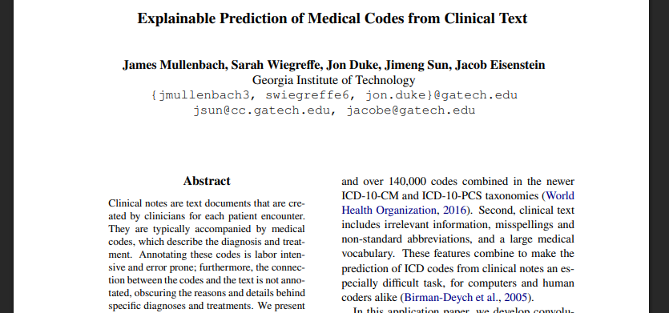
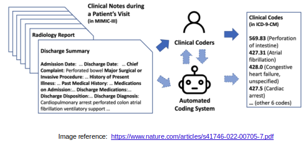
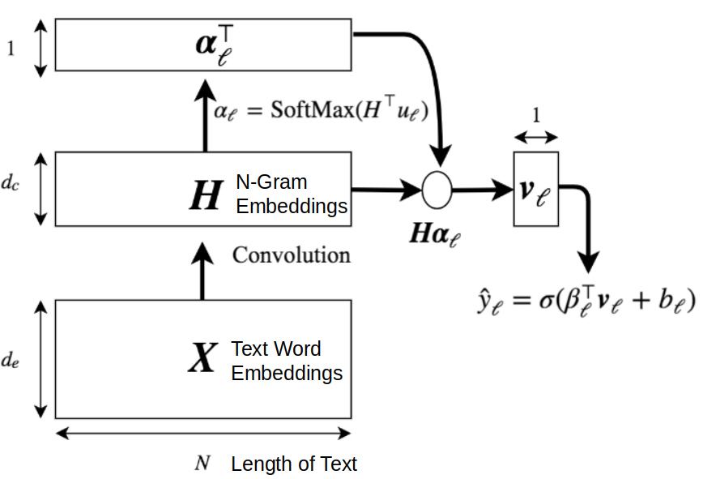
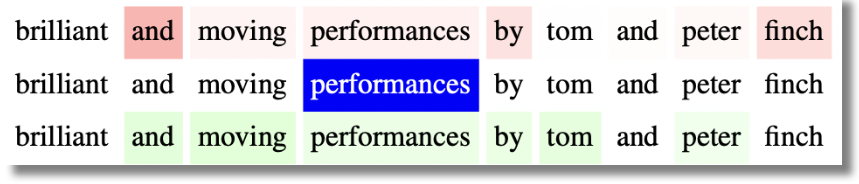

# Disclaimer

\input{../disclaimer.tex}

---

# Paper 1

[@mullenbach2018explainable]

---

# Introduction

:::: {.columns}
::: {.column width="52%"}

\vspace{2em}

- **Clinical notes**: free text narratives generated by clinicians during patient encounters

- **ICD codes**: metadata codes accompanying clinical notes
  - Standardized way of indicating diagnoses and procedures
  - Multiple use cases (billing, predictive modelling)

## In Plain English

Given a doctor's note, can a model automatically assign the right diagnostic codes — and point to the exact sentence in the text that justifies each one?

:::
::: {.column width="45%"}

\begin{center}
\includegraphics[width=0.85\columnwidth]{imgs/intro_example.png}
\end{center}

:::
::::

---

# Motivation

- **Limitation of ICD code annotation**
  - Labor intensive
  - Coders read 720--1,440 pages of clinical documentation per day
  - Prone to error
  - Lack of connection bridging text and code

- **Challenges of automatic coding**
  - Features of clinical text: irrelevant information, misspellings, non-standard abbreviations, large medical vocabulary
  - Label space

---

# Summary of Contributions

- **CAML**: Convolutional Attention for Multi-Label classification
  - Attentional convolutional network: CNN + per-label attention mechanism
  - Important information may be in short snippets anywhere in the document
  - Decision support in clinical domain

- **Accuracy Evaluation**
  - Used open-access MIMIC datasets
  - Outperformed previously proposed approaches

- **Interpretability Evaluation**
  - Physician rated the informativeness of automatically generated explanations

---

# Related Work: Automatic ICD Coding

:::: {.columns}
::: {.column width="55%"}

- Structured text v. unstructured text
- **Datasets**
  - Subset of full ICD label space (Wang et al., 2016)
  - Subset of medical scenarios (Zhang et al., 2017)
  - Death certificates in English + French (Névéol et al., 2017)
  - Private datasets (Subotin and Davis, 2016)
- **Approaches**
  - Recurrent networks with HA-GRU (Baumel et al., 2018)
  - Character-aware LSTMs (Shi et al., 2017)
  - Memory networks for top-50/100 codes (Prakash et al., 2017)
  - Grounded RNN for individual labels (Vani et al., 2017)

:::
::: {.column width="45%"}

{width=\columnwidth}

\vspace{2em}

\begin{alertblock}{}
\small CAML instead operates on the full ICD-9 label space using MIMIC-III, an open-access dataset.
\end{alertblock}

:::
::::

---

# Related Work: Explainable Text Classification

- **Latent rationales** (Lei et al., 2016): learn a latent variable that tags each word
  as relevant or irrelevant to the predicted label

- **Gradient-based salience** (Li et al., 2016): measure word importance by how much
  each word affects the output

- **Attention as explanation** (Rush et al., 2015; Rocktäschel et al., 2016): highlight
  salient text features using attention weights

## Key Gap

Prior work identifies *which* words the model focuses on, but never verifies whether **attending to completely different words** would have changed the prediction — leaving the causal link between attention and output unexamined.

---

# Related Work: Attentional Convolution for NLP

- CNNs applied to sentiment classification (Kim, 2014) and language modeling

- Convolution and attention: Allamanis et al., 2016; Yin et al., 2016; dos Santos et al., 2016; Yin and Schütze, 2017

- Most relevant work (Yang et al., 2016 and Allamanis et al., 2016):
  - Use context vectors (one for document) to compute attention over specific locations in the text

\vspace{1em}

## CAML Differentiation

- Goal: select locations most important for predicting specific labels
- Compute separate attention weights for each label in the label space

---

# ICD Code Prediction Problem

\vspace{1em}

\begin{center}
\includegraphics[width=0.75\columnwidth]{imgs/icd_prediction_problem.png}
\end{center}

**Multi-Label Classification Problem**

- "Match" snippets of clinical text to a label — each code is triggered by a
  **different part** of the document, not the document as a whole

- For rare codes with few training examples, use the **code's own text description**
  as an extra learning signal (e.g., "Cervical Degenerative Disc Disease" tells the
  model what kind of text should activate it)

---

---

# Typical Convolutional N-Gram Model

:::: columns
::: {.column width="50%"}

\vspace{1em}
\begin{center}
\includegraphics[width=\columnwidth]{imgs/cnn_ngram1.png}
\end{center}

:::
::: {.column width="48%"}

- Each word is represented as a dense vector (**word embedding**)
- A convolutional filter slides over **N consecutive words** at a time,
  detecting local patterns (e.g., "acute renal failure")
- Each filter learns to recognize a specific **"word snippet" motif**
- **Max pooling** asks: *was this pattern detected anywhere in the document?*
  — collapsing position information in the process

:::
::::

## Key Limitation

Max pooling discards *where* the pattern appeared — you know a pattern was detected, but you can't point to the sentence that triggered it, making the prediction unexplainable to a physician.

---

# Convolutional Attention Model

:::: {.columns}
::: {.column width="40%"}

{width=\columnwidth}

## Key Insight

Because $\mathbf{u}_\ell$ is different for every label, each code gets its own
attention distribution — and therefore its own extractable text snippet as explanation.

:::
::: {.column width="59%"}

1. **Convolution:** \textbf{$\mathbf{X} \rightarrow \mathbf{H}$}

   Each column of $\mathbf{H}$ is an n-gram embedding — a single vector capturing
   the meaning of N consecutive words in context.

2. **Per-label attention:** \textbf{$\boldsymbol{\alpha}_\ell = \text{SoftMax}(\mathbf{H}^\top \mathbf{u}_\ell)$}

   For each label $\ell$, compare every n-gram against the label vector $\mathbf{u}_\ell$
   via dot product, then normalize. Result: a distribution over document positions —
   *which fragment is most relevant for this code?*

3. **Weighted aggregation:**
   \textbf{$\mathbf{v}_\ell = \sum_{n=1}^{N} \alpha_{\ell,n} \mathbf{h}_n$}

   Instead of max pooling, sum all n-grams weighted by attention —
   preserving *where* the evidence came from.

4. **Classification:**
   \textbf{$\hat{y}_\ell = \sigma(\boldsymbol{\beta}_\ell^\top \mathbf{v}_\ell + b_\ell)$}

   Linear layer + sigmoid gives the probability for each code independently.

:::
::::

---

# Training Loss - Binary Cross-Entropy (CAML)

\textbf{$$L_{\text{BCE}}(\mathbf{X}, y) = -\sum_{\ell=1}^{\mathcal{L}} \left[ y_\ell \log(\hat{y}_\ell) + (1 - y_\ell) \log(1 - \hat{y}_\ell) \right]$$}

## In Plain English

Each code is treated as an **independent binary classification** — present or not —
and errors are accumulated over all ~9,000 possible codes.

---

# Training Loss Function - With Description Regularization (DR-CAML) 2/2

\textbf{$$L(\mathbf{X}, y) = L_{\text{BCE}} + \lambda \frac{1}{n_y} \sum_{\ell:\, y_\ell=1} \|\mathbf{z}_\ell - \boldsymbol{\beta}_\ell\|_2$$}

- $n_y$: number of true labels for data example
- $\mathbf{z}_\ell$: representation of label based on code description
- $\boldsymbol{\beta}_\ell$: representation of label learned by model

## In Plain English

For common codes, learn from data. For rare codes, stay close to
what the medical dictionary says the code means.

---

# Experimental Setup

:::::::::::::: {.columns}
::: {.column width="60%"}

**Dataset: MIMIC-III**

- **Input:** discharge summary (max 2,500 tokens)
- **Output:** ICD-9 codes — 7,000 diagnosis + 2,000 procedure (~9,000 total)
- **Embeddings:** 100-dim word2vec pretrained on corpus

| | MIMIC-III full |
|---|---|
| # training documents | 47,724 |
| Vocabulary size | 51,917 |
| Mean tokens / document | 1,485 |
| Mean labels / document | 15.9 |
| Total labels | 8,922 |

:::
::: {.column width="40%"}

**Baselines**

- Single-layer CNN (Kim, 2014)
- Logistic Regression (bag-of-words)
- Bidirectional GRU (BiGRU)

**Evaluation Metrics**

- Macro / Micro AUC and F1
- Precision@$n$ — fraction of top-$n$ predicted codes that are correct

:::
::::::::::::::

---

## Experimental Setup - Resume

**Each document is a long medical narrative; the model must simultaneously
predict ~16 codes on average, chosen from a space of nearly 9,000 —
making this an extremely sparse multi-label problem.**

---

# Results 1/2

\vspace{1em}
\begin{center}
\includegraphics[width=.75\columnwidth]{imgs/results.png}
\end{center}

- CAML gives strongest results on all metrics; DR-CAML is the regularized version ($\lambda = 0.01$)
- Bi-GRU comparable to vanilla CNN; Logistic Regression worse than all neural architectures

---

# Results - Micro vs. Macro Metrics

\vspace{1em}
\begin{center}
\includegraphics[width=.75\columnwidth]{imgs/results.png}
\end{center}

- **Macro:** computes the metric separately for each code then averages —
every code counts equally, regardless of frequency.
A very rare code weighs the same as a very common one.
- **Micro:** pools all true positives, false positives, and false negatives
across all codes before computing — frequent codes dominate the result.

## In this problem the difference is critical
A model that ignores rare codes can still achieve high Micro-F1, but will be heavily penalized by Macro-F1.

---

# Interpretability Evaluation

- Sample of 100 predicted codes
- Most important $k$-gram ($k=4$) + five words on each side for context
- Asked the Physician how informative it is

---

# Another Baseline: Cosine Similarity Explanation

One of the baselines for extracting the text snippet that explains each code.

- Given an ICD code, it computes the cosine similarity between each 4-gram in the document and the code's text description — and returns the most similar one.

It is a purely lexical method: no model involved, just word comparison.

## Key Limitation

Works well when the document **literally repeats** words from the code description
— **fails** when the relationship is implicit or uses different terminology.

---

# Interpretability: Qualitative Examples

\begin{center}
\includegraphics[width=.8\columnwidth]{imgs/interpretability_examples.png}
\end{center}

---

# How to Pick the Most Influential 4-gram?

- **CAML**: looks at SoftMax output $\boldsymbol{\alpha}_\ell$ to get the best 4-gram for code $\ell$
- **Logistic Regression**: sum of weight matrix coefficients for $\ell$ over words in $k$-gram; top-scoring $k$-gram returned
- **Code descriptions**: cosine similarity between each stemmed $k$-gram and stemmed ICD-9 code description
- **Max-Pooling CNN**:

  $$a_i = \arg\max_{j \in \{1,\ldots,m-k+1\}} (H_{ij}), \qquad \alpha_{i\ell} = \sum_{j:\, a_j=i} \beta_{\ell,j}$$

  Select the most important $k$-gram as $\arg\max_i \alpha_{i\ell}$

---

# Qualitative Evaluation Results

| Method | Informative | Highly informative |
|---|---|---|
| CAML | 46 | **22** |
| Code Descriptions | 48 | 20 |
| Logistic Regression | 41 | 18 |
| CNN | 36 | 13 |

\vspace{0.3cm}

- CAML selects the greatest number of "highly informative" explanations
- CAML selects more "informative" explanations than both CNN and logistic regression
- Cosine Similarity also performs well; examples in Table 1 demonstrate strengths of CAML

---

# Conclusion

## Concluding Thoughts

- Yields strong improvements over previous metrics across several formulations of ICD-9 code prediction
- Provides satisfactory explanations for its predictions per stakeholder evaluation

## Future Work

- **Extensible** to other multi-label document tagging tasks
- **Linguistic perspective**: integrate document structure of discharge summaries; better handle out-of-vocabulary tokens
- **Application perspective**: leverage hierarchy of ICD codes; predict codes for future visits

---

# Discussion (Paper 1)

1. What are potential limitations of CAML?

2. The explanations from the attention mechanism are extracted text snippets. Does this provide enough information? What else could be provided?

3. Strengths and weaknesses of their evaluation and results (accuracy and interpretability)

4. What additional applications could CAML be useful for?

---

# Paper 2

\begin{center}
\Large \textbf{Attention is \textit{not} Explanation}
\end{center}

\vspace{0.5cm}

\begin{center}
\textbf{Authors}: Sarthak Jain, Byron C. Wallace

\textbf{Presenters}: Nikhil Nayak, Sree Harsha Tanneru, Hongjin Lin

2023/03/06
\end{center}

\vfill
[@jain2019attention]

---

# Attention Mechanism: a "Recent" Breakthrough in NLP

- **2015**: birth of attention mechanism in NLP
  - "Neural machine translation by jointly learning to align and translate" (Bahdanau et al., 2015)

- **2017**: birth of transformers based on self-attention mechanism
  - "Attention is all you need" (Vaswani et al., 2017)

\begin{center}
\includegraphics[width=0.8\columnwidth]{imgs/attention_example.png}
\end{center}

---

# Many Use Attention as an Explanation Mechanism

\begin{center}
\includegraphics[width=0.85\columnwidth]{imgs/attention_as_explanation.png}
\end{center}

---

# But Does Attention Provide Faithful Explanations?

\begin{center}
\includegraphics[width=0.7\columnwidth]{imgs/adversarial_heatmap.png}
\end{center}

Despite very different attention weights, both yield effectively the same prediction (0.01).

---

# Research Questions

**What is the degree to which attention weights provide meaningful "explanations" for predictions?**

\vspace{0.5cm}

1. \textcolor{blue}{\textbf{Consistency}}: To what extent do induced attention weights **correlate with measures of feature importance** — specifically, those from gradients and leave-one-out (LOO) methods?

2. \textcolor{red}{\textbf{Counterfactual attention weights}}: Would **alternative attention weights** (and hence distinct heatmaps/"explanations") necessarily yield different predictions?

---

# Contributions and Main Findings

1. Standard attention modules **do not provide meaningful explanations** and should not be treated as though they do.

2. Learned attention weights are frequently \textcolor{blue}{\textbf{uncorrelated with gradient-based}} measures of feature importance.

3. One can identify very \textcolor{red}{\textbf{different attention distributions}} that nonetheless yield equivalent predictions.

---

# Experimental Setup

\begin{center}
\includegraphics[width=\columnwidth]{imgs/experimental_setup.png}
\end{center}

---

# Correlation Between Attention and Feature Importance

To what extent do induced attention weights correlate with measures of feature importance?

Specifically two methods are considered:

1. Feature gradient methods
2. Leave-One-Out (LOO) method

---

# Gradient-Based Feature Importance

- Compute the gradient of the output with respect to each input feature
- This tells us how much changing each feature would affect the output
- Visualize by highlighting input features with highest absolute gradient values

---

# Feature Erasure / LOO

- Remove one input feature at a time and observe how the output changes
- This allows us to measure the impact of each feature on the output
- Visualize by highlighting the removed feature and showing the change in output

---

# Distribution Change Measure

**Total Variation Distance (TVD), Kendall's $\tau$ coefficient**

$$\text{TVD}(\hat{y}_1, \hat{y}_2) = \frac{1}{2} \sum_{i=1}^{|\mathcal{Y}|} |\hat{y}_{1i} - \hat{y}_{2i}|$$

$$\tau = \frac{\text{(concordant pairs)} - \text{(discordant pairs)}}{\text{(number of pairs)}} = 1 - \frac{2\,\text{(discordant pairs)}}{\binom{n}{2}}$$

---

# Algorithm for Feature Importance Computations

$$\mathbf{h} \leftarrow \text{Enc}(\mathbf{x}),\quad \hat{\alpha} \leftarrow \text{softmax}(\phi(\mathbf{h}, \mathbf{Q}))$$
$$\hat{y} \leftarrow \text{Dec}(\mathbf{h}, \alpha)$$
$$g_t \leftarrow \left| \sum_{w=1}^{|V|} \mathbf{1}[\mathbf{x}_{tw}=1]\,\frac{\partial y}{\partial \mathbf{x}_{tw}} \right|, \quad \forall t \in [1,T]$$
$$\tau_g \leftarrow \text{Kendall-}\tau(\alpha, g)$$
$$\Delta\hat{y}_t \leftarrow \text{TVD}(\hat{y}(\mathbf{x}_{-t}), \hat{y}(\mathbf{x})),\quad \forall t \in [1,T]$$
$$\tau_{\text{loo}} \leftarrow \text{Kendall-}\tau(\alpha, \Delta\hat{y})$$

---

# Feature Gradients Results

Histogram of Kendall correlation between attention and gradients.

\begin{center}
\includegraphics[width=0.9\columnwidth]{imgs/feature_gradients_results.png}
\end{center}

---

# Correlation Comparison: Attention, Gradients, LOO

\begin{center}
\includegraphics[width=\columnwidth]{imgs/correlation_comparison.png}
\end{center}

\footnotesize Fig 1: LOO, Gradients vs Attention, LOO. \quad Fig 2: LOO, Gradients vs Attention, Gradients.

---

# Possible Limitations in Experiment Results

1. Potential issues with Kendall $\tau$ correlation — many irrelevant features may add noise to the correlation measures

2. Alternative measures of feature importance (gradients and LOO) may not be considered ideal or the 'ground truth' for comparison purposes

---

# Counterfactual Attention Weights

**Would the prediction be different if the model attended to different input features?**

:::: {.columns}
::: {.column width="55%"}

1. \textcolor{blue}{\textbf{Consistency}}: correlation with other measures of feature importance
2. \textcolor{red}{\textbf{Counterfactual attention distributions}} should yield corresponding changes in predictions

:::
::: {.column width="45%"}

{width=\columnwidth}

:::
::::

---

# Counterfactual Attention: Two Experiments

1. \textcolor{blue}{\textbf{Attention Permutation}}: scramble the original attention weights

2. \textcolor{red}{\textbf{Adversarial Attention}}: generate an adversarial distribution that is maximally distinct from the observed attention weights, whilst simultaneously close to the observed prediction

---

# Attention Permutation: Algorithm

:::: {.columns}
::: {.column width="50%"}

$\mathbf{h} \leftarrow \text{Enc}(\mathbf{x}),\; \hat{\alpha} \leftarrow \text{softmax}(\phi(\mathbf{h}, \mathbf{Q}))$

$\hat{y} \leftarrow \text{Dec}(\mathbf{h}, \hat{\alpha})$

\textbf{for} $p \leftarrow 1$ to $100$ \textbf{do}

$\quad \alpha^p \leftarrow \text{Permute}(\hat{\alpha})$

$\quad \hat{y}^p \leftarrow \text{Dec}(\mathbf{h}, \alpha^p)$ \hfill $\triangleright$ $\mathbf{h}$ not changed

$\quad \Delta\hat{y}^p \leftarrow \text{TVD}[\hat{y}^p, \hat{y}]$

\textbf{end for}

$\Delta\hat{y}^{med} \leftarrow \text{Median}_p(\Delta\hat{y}^p)$

:::
::: {.column width="50%"}

- $\mathbf{h}$ (the hidden state) is kept fixed
- Only the attention weights are permuted
- Measures how much the output changes when attention is scrambled

:::
::::

---

# Attention Permutation: Results

\begin{center}
\includegraphics[width=0.9\columnwidth]{imgs/attn_permutation_results.png}
\end{center}

\footnotesize Median change in output $\Delta\hat{y}^{med}$ (x-axis) densities vs max attention (y-axis) by randomly permuting attention weights.

---

# Adversarial Attention

- Explicitly seek attention weights that differ as much as possible from observed weights, yet leaving prediction almost unchanged
- **Why?** Alternative attention distributions for the same output may be viewed as equally plausible explanations:
  - Cannot conclude the model made a specific prediction because it attended in a certain way
  - Lack of specificity makes constructing counterfactual explanations hard
  - Makes model less trustworthy

---

# Adversarial Attention: Optimisation

$$JSD(\alpha_1, \alpha_2) = \frac{1}{2}\!\left(KL\!\left[\alpha_1 \,\Big|\, \frac{\alpha_1+\alpha_2}{2}\right] + KL\!\left[\alpha_2 \,\Big|\, \frac{\alpha_1+\alpha_2}{2}\right]\right)$$

Seek $\alpha^{(1)}, \ldots, \alpha^{(k)}$ that maximize $f$ subject to small output change:

$$\underset{\alpha^{(1)},\ldots,\alpha^{(k)}}{\text{maximize}} \; f\left(\{\alpha^{(i)}\}_{i=1}^k\right) \quad \text{s.t.} \quad \forall i\; \text{TVD}[\hat{y}(\mathbf{x}, \alpha^{(i)}), \hat{y}(\mathbf{x}, \hat{\alpha})] \leq \epsilon$$

$$f\!\left(\{\alpha^{(i)}\}_{i=1}^k\right) = \sum_{i=1}^k JSD[\alpha^{(i)}, \hat{\alpha}] + \frac{1}{k(k-1)} \sum_{i<j} JSD[\alpha^{(i)}, \alpha^{(j)}]$$

---

# Adversarial Attention: Algorithm

$\mathbf{h} \leftarrow \text{Enc}(\mathbf{x}),\; \hat{\alpha} \leftarrow \text{softmax}(\phi(\mathbf{h}, \mathbf{Q}))$

$\hat{y} \leftarrow \text{Dec}(\mathbf{h}, \hat{\alpha})$

$\alpha^{(1)}, \ldots, \alpha^{(k)} \leftarrow \text{Optimize Eq 1}$

\textbf{for} $i \leftarrow 1$ to $k$ \textbf{do}

$\quad \hat{y}^{(i)} \leftarrow \text{Dec}(\mathbf{h}, \alpha^{(i)})$ \hfill $\triangleright$ $\mathbf{h}$ is not changed

$\quad \Delta\hat{y}^{(i)} \leftarrow \text{TVD}[\hat{y}, \hat{y}^{(i)}]$

$\quad \Delta\alpha^{(i)} \leftarrow JSD[\hat{\alpha}, \alpha^{(i)}]$

\textbf{end for}

$\epsilon\text{-max JSD} \leftarrow \max_i \mathbf{1}[\Delta\hat{y}^{(i)} \leq \epsilon]\,\Delta\alpha^{(i)}$

---

# Adversarial Attention: Results

\begin{center}
\includegraphics[width=0.85\columnwidth]{imgs/adversarial_results1.png}
\end{center}

\footnotesize Histogram of max adversarial JS Divergence ($\epsilon$-max JSD) between original and adversarial attentions. In all cases $|\hat{y}^{adv} - \hat{y}| < \epsilon$.

---

# Adversarial Attention: Results

\begin{center}
\includegraphics[width=0.85\columnwidth]{imgs/adversarial_results2.png}
\end{center}

\footnotesize Densities of max JS divergences ($\epsilon$-max JSD, x-axis) as a function of the max attention (y-axis) in each instance.

---

# Counterfactual Attention: Limitations

- Adversarial weights may themselves be unlikely under model parameters
- There are instances where a single explanation out of multiple plausible explanations is sufficient

---

# Overall Limitations

- Alternate attention mechanisms are not explored
- Limited evaluations to classification, QA, and NPI tasks; seq2seq tasks are not considered

---

# Critique and Discussion

- Wiegreffe & Pinter (2019), *Attention is not not Explanation*, EMNLP-IJCNLP:
  - Attention distribution is not a primitive
  - Is attention necessary for prediction?
  - Is the variance in attention distributions unusual? i.e., How adversarial are the adversaries?

- Do you agree with the authors' conditions of a "faithful explanation"?
- Do you think attention constitutes a "sufficient" explanation?
- What other conditions should we consider as a good explanation?
- How can experts be brought in to evaluate conditions of good explanations?

---

\begin{center}
\Huge Thank You!
\end{center}

---

# References {.allowframebreaks}

\footnotesize
